刷完了课，作业完成了cuda相关的基础要求（[GPU-Programming/CIS565 at main · jsjtxietian/GPU-Programming](https://github.com/jsjtxietian/GPU-Programming/tree/main/CIS565)），vulkan的略过了。

## Lecture1 Overview

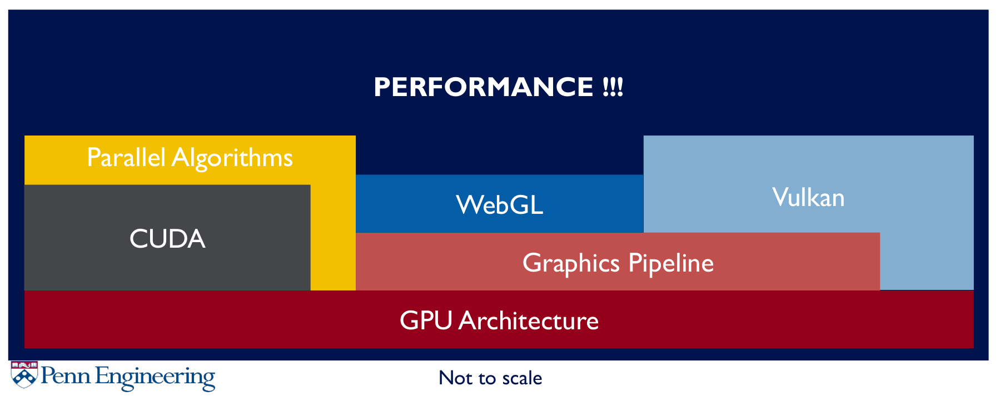

## Lecture1-2 Cuda introduction

Cuda基础概念介绍与入门

### Scheduling Threads

**Blocks execute independently**：In any order，parallel or series；Scheduled in any order by any number of cores（Allows code to scale with core count）

[Microsoft Word - Chapter 2 - Cuda Programming Model.doc](https://www.greatlakesconsortium.org/events/GPUMulticore/Chapter2-CudaProgrammingModel.pdf)

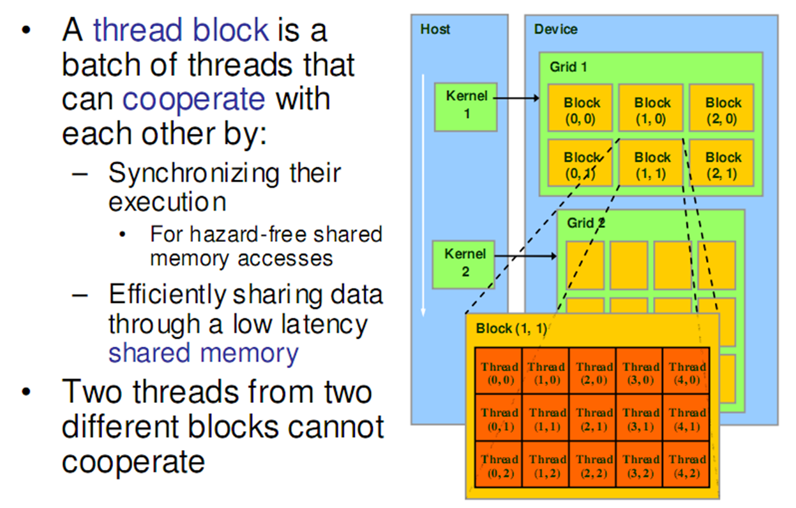

What actually happens when you launch a kernel say with 100 blocks each with 64 threads?

* Let's say on a GT80 (i.e. 16 SMs, 8 SPs each)
* MaxT/block is 512, MaxT/SM is 768 threads
* Chip level scheduling:
  * 100 blocks of 64 threads
  * 768/64 = max 12 blocks can be scheduled for every SM
* SM level scheduling:
  * 12 blocks = 768 threads = 24 warps
  * Warp scheduler kicks in:
    * 8 threads -> 8 threads -> 8 threads -> 8 threads

[CudaThreadingModel](http://www.cs.put.poznan.pl/rwalkowiak/pliki/2018/prz/cuda_textbook/KirkHwuTextbook_Chapter3-CudaThreadingModel.pdf)

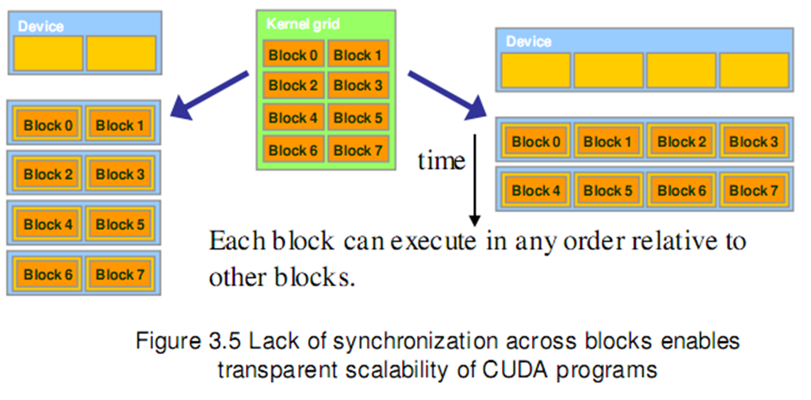

### Warp 

threads from a block

* For modern GPUs – **32 threads**
* Run on the same SM
* Unit of thread scheduling (i.e. warp scheduler)
* Consecutive **threadIdx** values
* An implementation detail – in theory
  * **warpSize**

[2010 gpuArchShaderCores](https://courses.cs.washington.edu/courses/cse558/11wi/lectures/05_gpuArchShaderCores_BPS_2011.pdf)

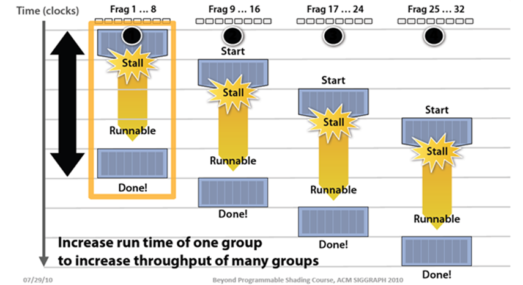

### Memory

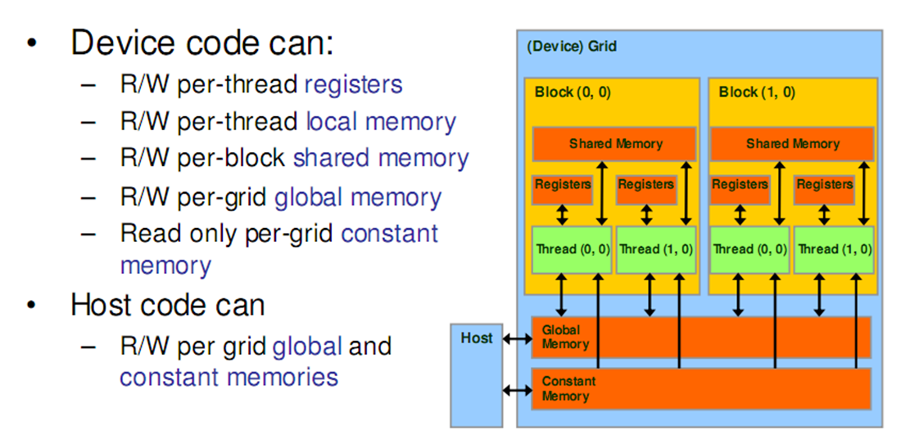

**Registers**：Per thread；Fast, on-chip, read/write access；Increasing the number of registers used by a kernel：Lower Thread Occupancy: Potentially decrease the number of threads (well, blocks) available to that SM for scheduling.

[Slide 1 register_spilling](https://developer.download.nvidia.cn/CUDA/training/register_spilling.pdf)

**Local Memory**：Refers to memory where registers and other thread-data is **spilled**. Usually when one runs out of SM resources；“Local” because each thread has its own private area；Arrays declared inside kernels (if compiler can’t resolve indexing)；Not really a “memory” – bytes are **stored in global memory**

Differences from global memory：Addressing is resolved by the compiler；**Stores are cached in L2** (SM 5.x and newer)

**Shared Memory**：Per block, Lifetime of the block；Fast, on-chip, read/write access；Full speed random access; Acts as a user-controlled cache, Accessible from all threads in the block;  Allocate statically or at kernel launch; Cache data to reduce redundant global memory access, Improve global memory access patterns; Divided into 32 32-bit banks

**Global Memory**：Long latency (100s cycles)；Off-chip, read/write access；Random access causes performance hit；Host can read/write；Reads are cached (2.x and newer)；But writes invalidate the cache

**Constant Memory**：Short latency, high bandwidth, read only access when all threads access the same location；Stored in global memory but cached；Host can read/write；Up to 64 KB

## Lecture3 GPU Architecture

主要是cpu和gpu的架构对比

### CPU optimized for sequential programming

* Pipelines, branch prediction, superscalar, OoO
* Reduce execution time with high clock speeds and high utilization
* Slow memory is a constant problem

A lot of effort put into improving IPC, and avoiding memory latencies. Attacking throughput is an entirely different game.

### Why GPU

* Graphics workloads are embarrassingly parallel：Data-parallel，Pipeline-parallel
* CPU and GPU execute in parallel
* Hardware: texture filtering, rasterization, etc.

In simplicity, SIMD uses explicit vector instructions such as using vectorized loop；SIMT however simply relies on calling the kernel across all individual threads, thus essentially making it a "scalar". Because each thread is a scalar.  SIMT also allows for branch divergence, although it's still not efficient.

[2010 how a gpu works](https://www.cs.cmu.edu/afs/cs/academic/class/15462-f11/www/lec_slides/lec19.pdf)

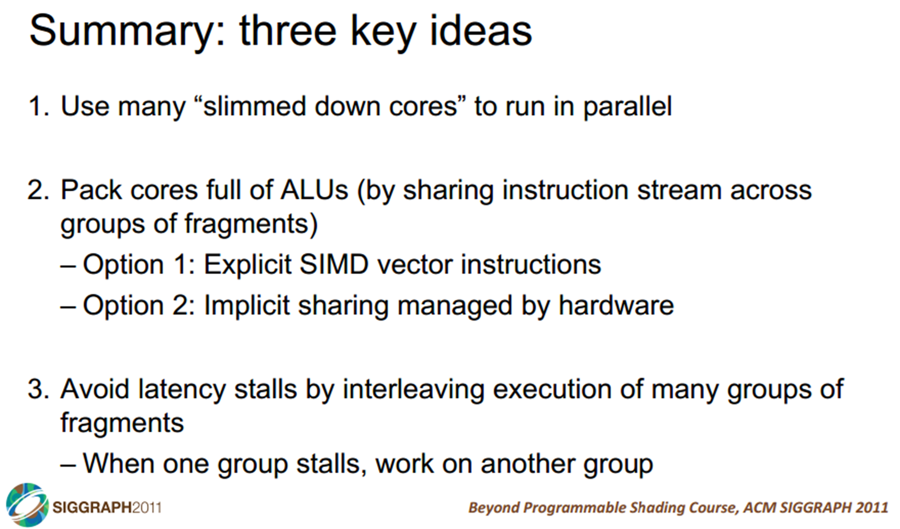

### AI and Memory Wall

[AI and Memory Wall. (This blogpost has been written in… | by Amir Gholami | riselab | Medium](https://medium.com/riselab/ai-and-memory-wall-2cb4265cb0b8)

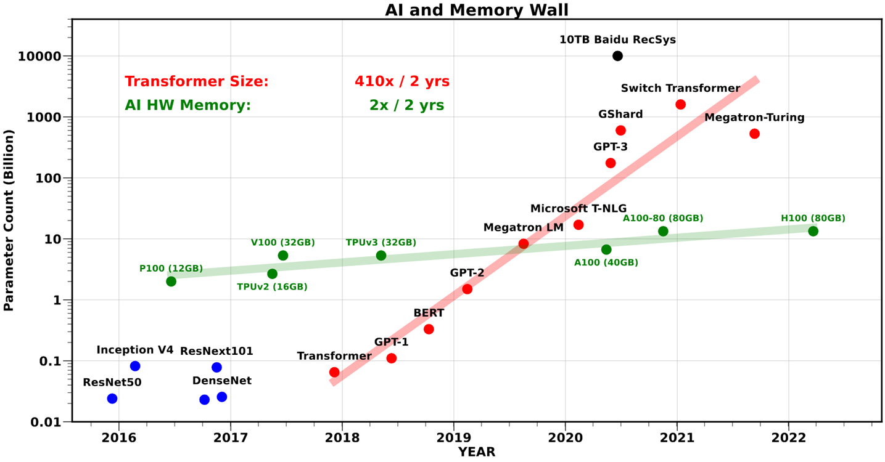

Deep learning requires a large amount of memory：Store the whole model for training and inference
**Keep lots of memory close to the compute unit**，So the data transfer is fastest possible

## Lecture4 Parallel Algorithms

见作业

* Parallel Reduction
* Scan (Naive and Work Efficient)
* Applications of Scan
  * Stream Compaction
  * Summed Area Tables (SAT)
  * Radix Sort

An understanding of parallel programming **and** GPU architecture yields efficient GPU implementations

## Lecture5-7 Cuda Performance

### Maximize Utilization

* Warp Partitioning：
  * how threads from a block are divided into warps
  * Minimize divergent branches；Good partitioning also allows warps to be retired early => Better hardware utilization
  * Make threads per blocks to be a multiple of a warp (32)：Incomplete warps waste unused cores, 128-256 threads per blocks is a good starting point; Try to have all threads in warp execute in lock step

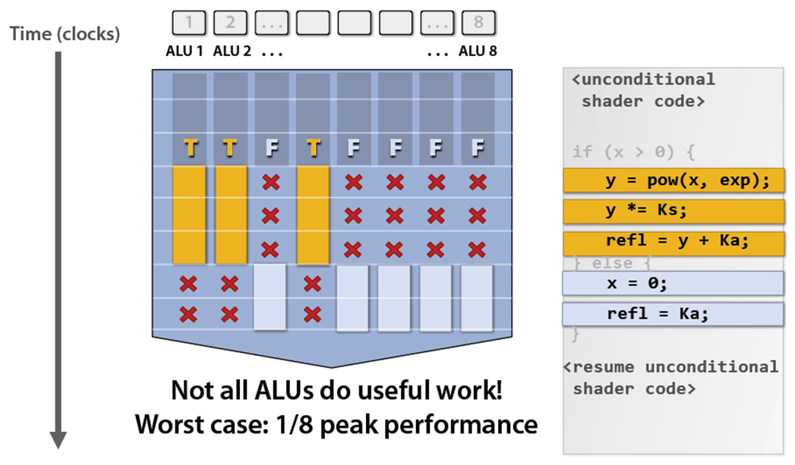

### Maximize Memory Throughput

#### Memory Coalescing (Device Level)：

* Think in terms of **parallel threads access**，want **threads within an iteration** to be accessing continuous memory; Achieve peak bandwidth by requesting large, **consecutive locations** from DRAM
* The concurrent accesses of the threads of a warp will coalesce into a number of transactions equal to the number of cache lines necessary to service all of the threads. The GPU coalesces consecutive reads in a **full-warp** into a single read => read global memory in a coalesce-able fashion into shared memory, Then access shared memory **randomly** at maximum bandwidth
* L1 cache is 128-bytes aligned, Multiples of 128B are read; L2 cache is 32-bytes aligned,  Multiples of 32B are read； **L1 cache are also accessed by 32 Bytes**, 1 Sector = 32 Bytes, 1 Cache Line = 4 Sectors = 128 Bytes (for L1, L2)
* For Modern GPUs, **L1 is reserved for Local Memor**y，**accesses to global memory are cached only in L2**; **Global Memory -> L2 caching**
* [How to Access Global Memory Efficiently in CUDA C/C++ Kernels | NVIDIA Technical Blog](https://developer.nvidia.com/blog/how-access-global-memory-efficiently-cuda-c-kernels/)  [KirkHwuTextbook_Chapter5-CudaPerformance.pdf](http://www.cs.put.poznan.pl/rwalkowiak/pliki/2018/prz/cuda_textbook/KirkHwuTextbook_Chapter5-CudaPerformance.pdf)

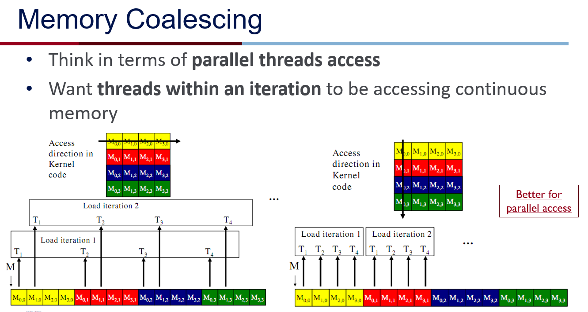

#### Bank Conflicts (Warp Level)

* Shared Memory (Sometimes called a **parallel data cache**), Multiple threads can access shared memory at the same time, Memory is divided into **banks**
* Each bank can service one **address** per cycle; Per-bank bandwidth: 32-bits per clock cycle; Successive 32-bit **words** are assigned to successive banks
* **Bank Conflict**: Two simultaneous accesses to the same bank, but not the same address => **Serialized !!!**
* Fast Path：All threads in a warp access different banks；Two or more threads in a warp access the **same address** =>“**Broadcast**”
* Slow Path: Multiple threads in a warp access the same **bank**
* [shared-memory-and-memory-banks](https://docs.nvidia.com/cuda/archive/9.2/cuda-c-best-practices-guide/index.html#shared-memory-and-memory-banks)

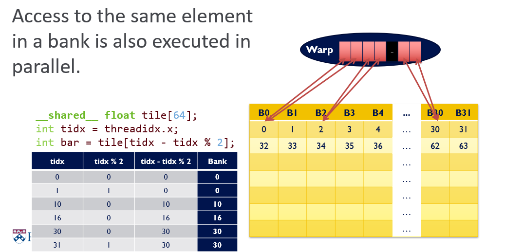

#### Dynamic Partitioning of SM Resources

* **Performance Cliff**: Increasing resource usage leads to a dramatic reduction in parallelism. For example, increasing the number of registers, unless doing so hides latency of global memory access
* **Occupancy**: The ratio of active warps and maximum possible warps. Low occupancy = less latency hiding; High occupancy = better performance? (not always)

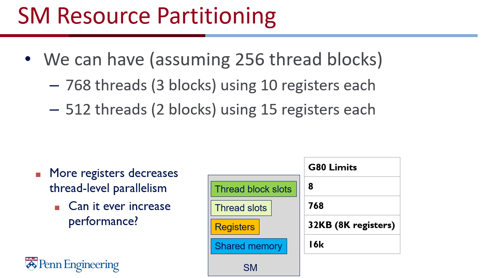

### Maximize Instruction Throughput

#### Data Prefetching

* Independent instructions between a global memory read and its use can hide memory latency
* **Prefetching** data from global memory can effectively increase the number of independent instructions between global memory read and use

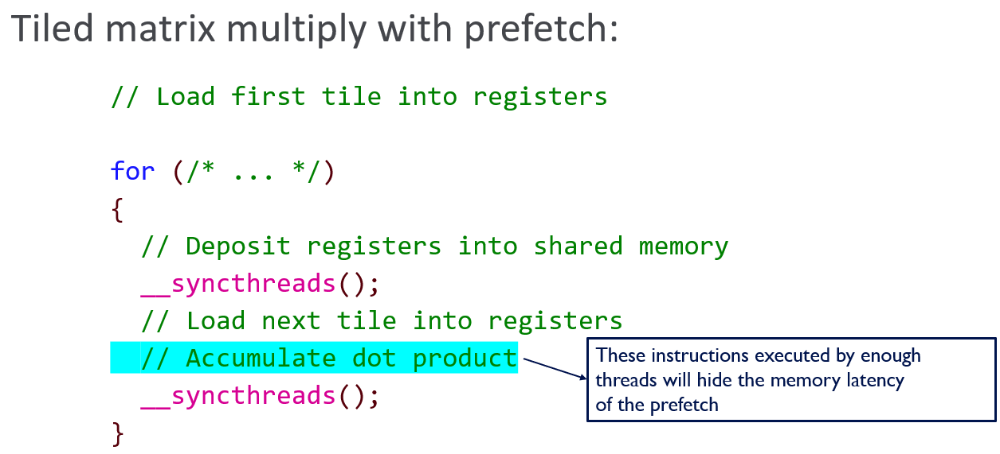

#### Instruction Mix

* Special Function Units (SFUs) : Single-precision floating-point; Use to compute __sinf(), __expf() etc; Modern GPUs have either 16 or 32 SFUs each running at 1 instruction per clock; **Use when speed trumps precision**

#### Loop Unrolling

* No more loop: No loop count update; No branch; Constant indices – no address arithmetic instructions
* Need to know the size at compile time; Increased register usage -> remember at the assembly level, you're still doing A + B = C; Instruction cache misses -> the code size increases, and potentially uses more cache to store the instructions, causing other instructions to potentially not fit on cache
* Manually unrolling avoids the disadvantages of predication (which itself is only used for a few-instruction branch).

#### Thread Granularity

Independent instructions -> can leverage ILP (Instruction-level parallelism)

More registers and shared memory -> lower occupancy

### 优化案例

Performance Lab 手把手教了**Nsight Compute**怎么用（数据真的详细），以及优化Transpose和Reduction

* Stage 0: Interleaved Addressing
* Stage 1: Remove Modulo
* Stage 2: Sequential Addressing & Non-divergent Warps
* Stage 3: Reducing Warp Wastage，Add on load
* Stage 4: Last Warp Unroll
* Stage 5: Complete Unroll：Use Templates

### Conclusion

* Understand CUDA performance characteristics：Memory coalescing；Divergent branching；Bank conflicts；Latency hiding
* Use peak performance metrics to guide optimization：Know peak GFLOPs and Memory Bandwidth of GPU；Know how to identify type of bottleneck，e.g. memory, core computation, or instruction overhead
* Optimize your algorithm, then unroll loops
* Use template gracefully：CUDA supports C++ template parameters on device and host functions，Specify block size as a function template parameter

## Lecture8 Advance Topics in CUDA

一些新东西：
- CUDA Unified Memory
- Faster Memory Transfers
- Zero Copy
- CUDA Streams
- CUDA Graph
- CUDA Dynamic Parallelism
- Atomic Functions
- Warp Functions
- Cooperative Groups

## Lecture9-11 Graphics

Graphics Pipeline 到 **Forward and Deferred Shading**，是相对比较简练的介绍，给的参考资料也很多

Evolution: **Forward -> Deferred -> Forward**，Went from compute-bound to memory-bound，Modern game engines combine **both** techniques 

NSight Graphics好用

## Lecture12-13 ML

**Basic Linear Algebra Subroutine (BLAS)**
* Standard set of functions for fast matrix operations
* BLAS implementations are often optimized by hardware manufacturers for speed on a particular machine. Using things like vector registers and SIMD instructions
* Many BLAS compatible libraries：MATLAB, numpy, R, GLM, etc.

**cuBLAS** is a BLAS implementation written by NVIDIA that uses CUDA 

**cuDNN** is another closed source library from NVIDIA，Built on top of cuBLAS
* Provides functions (forward/backward) for: Convolution, Max Pooling, Softmax, Sigmoid/ReLU/Tanh
* Does not provide linear layer! (use cuBLAS for that!)

**Computational graphs** are a way of representing a neural network’s flow of information，Helps us understand what derivatives get backpropagated where. Pytorch and Tensorflow both **allow dynamic ”just-in-time” updates to the computational graph**, Many optimizations can be done on computational graphs (Layer fusion, quantization of weights, pruning, etc.), These optimizations are **structurally impossibl**e on Pytorch and Tensorflow v2.0.

**Recap:**
* C++ code that directly calls cuBLAS and cuDNN is the industry standard for ML performance on GPU
* However, unless you’re trying to push the limits of scale, training time is generally much cheaper than inference time
* For training small models, Pytorch and Tensorflow are great: Lots of resources, easy to prototype, flexible, clean syntax
* For inference, Pytorch and Tensorflow are not so great: Dynamic updates to computational graph -> can’t optimize
* TensorRT is a good middle ground: Train model w/ PT & TF, export graph to ONNX, run with TensorRT; Automatically does a lot of perf improvements! Good baseline!

## 其他

* 2023年的vulkan入门介绍，webgpu不感兴趣没看
* 各个作业的recitation，很practical

### Ray tracing in 2023

Gray = fixed-function / hardware. Improves over time.
Diamond = some kind of scheduling happening
White = programmable

Ray generation and shading is the **developers responsibility**. Workflow is often recursive, shaders can trace rays.

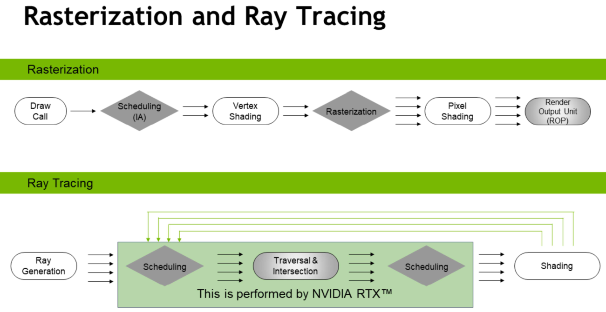

BVH not a new idea. Been around for decades. But **devil is in the details** if you want it really fast. Lots of research around that, both construction and traversal, from NV and many others.

[Introduction to DirectX RayTracing](https://intro-to-dxr.cwyman.org/) [IntroDXR_RaytracingShaders](https://intro-to-dxr.cwyman.org/presentations/IntroDXR_RaytracingShaders.pdf)   

[Real-Time_Rendering_4th-Real-Time_Ray_Tracing.pdf](https://www.realtimerendering.com/Real-Time_Rendering_4th-Real-Time_Ray_Tracing.pdf)

RESIR

* [A Gentle Introduction to ReSTIR: Path Reuse in Real-time](https://intro-to-restir.cwyman.org/)  
* [Reading list on ReSTIR – Light is beautifulLight is beautiful](https://lousodrome.net/blog/light/2022/05/14/reading-list-on-restir/)

RTXGI等

* [Scaling Probe-Based Real-Time Dynamic Global Illumination for Production (JCGT)](https://jcgt.org/published/0010/02/01/)
* [Dynamic Diffuse Global Illumination Resampling](https://casual-effects.com/research/Majercik2021Resampling/index.html)

[Real-time Neural Radiance Caching for Path Tracing | Research](https://research.nvidia.com/publication/2021-06_real-time-neural-radiance-caching-path-tracing)

NERF：[NeRFs - YouTube](https://www.youtube.com/playlist?list=PLIKGmqN18NQHBnqY8ecvgpg5PPytY7dlB)以及一些其他链接。

**LeFohn’s Law**：The job of the renderer is not to make the picture; the job of the renderer is to collect enough samples that the AI can make the picture. So sample N+1 should tell the AI as much as possible that it didn’t already know from samples [1..N].

一些建议：

The book Four Thousand Weeks is a good read about the philosophy and goals of time management. If you don’t have time, just read the first chapter. [Moving Targets, and Why They’re Bad | Real-Time Rendering](https://www.realtimerendering.com/blog/moving-targets-and-why-theyre-bad/)

More books：[Ray Tracing Resources Page](https://www.realtimerendering.com/raytracing.html#books)  [raytracinggems.com](http://raytracinggems.com/)

### Embedded graphics lecture

[CIS 5650 - Guest Lecture - Gabe Dagani_](https://www.bilibili.com/video/BV1mQ4y177tj?spm_id_from=333.788.videopod.episodes&vd_source=2ed13612df005a05ffd15b1da3dab557&p=19)

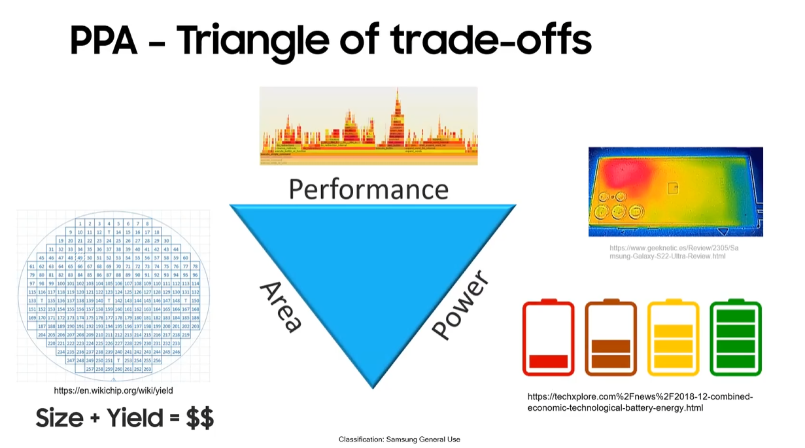

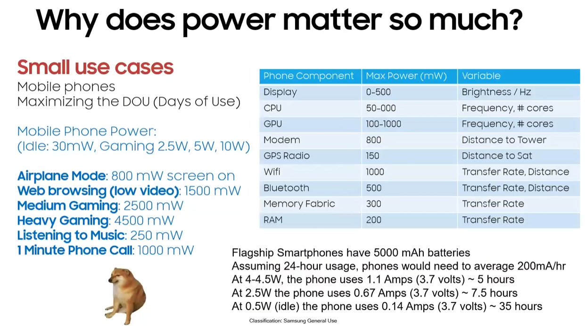

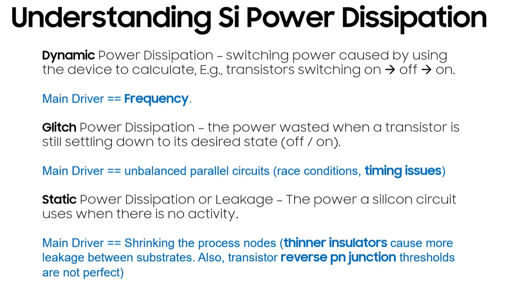

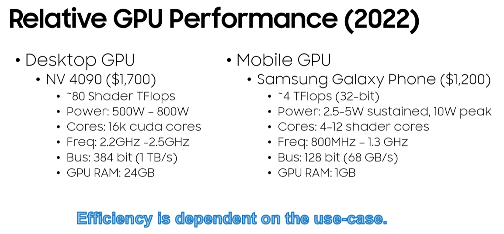

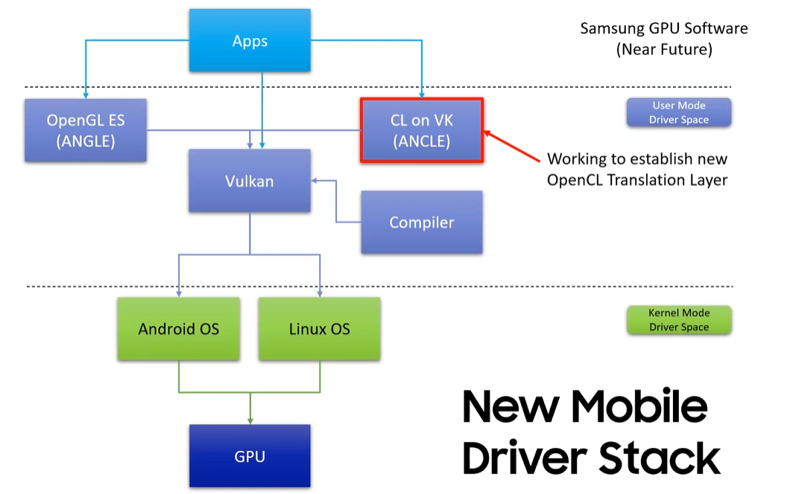

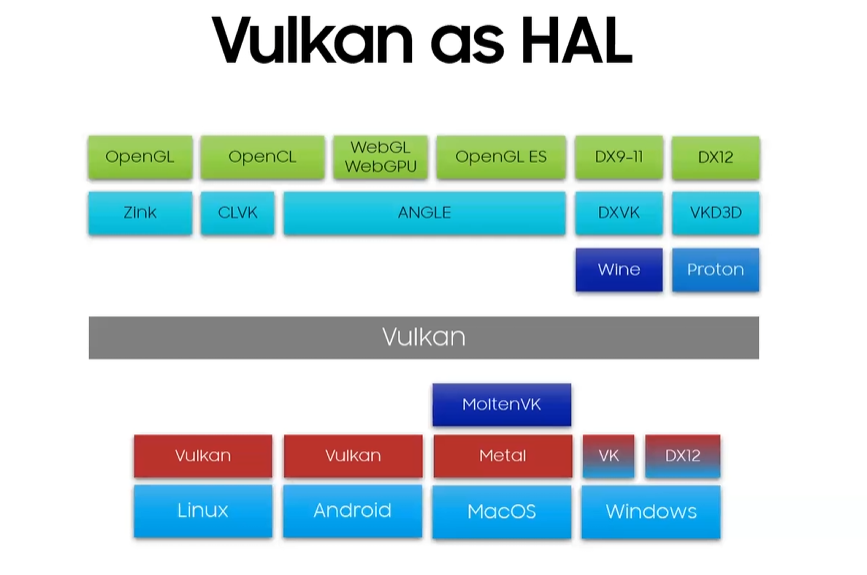
