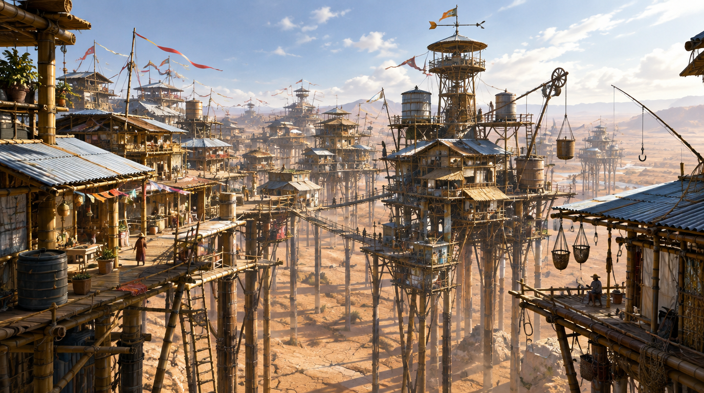
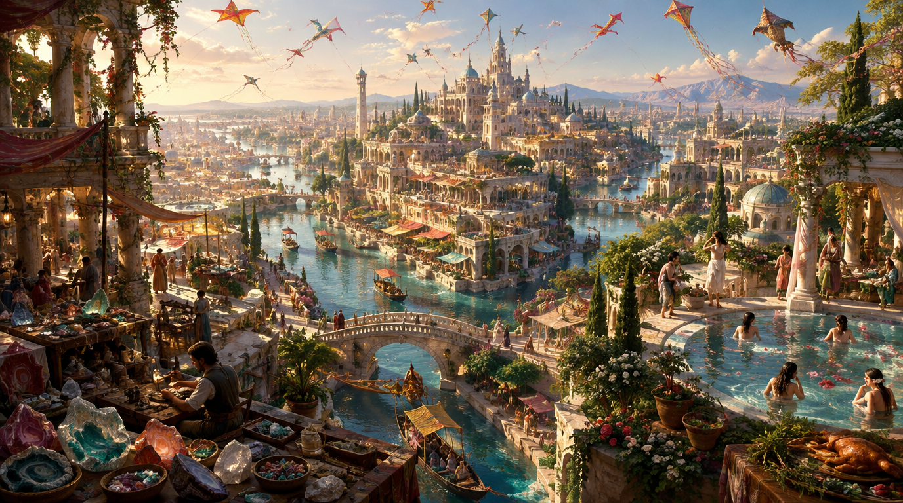

最近在读卡尔维诺的《看不见的城市》，想起来以前看到的一个可视化项目：[Calvino](https://calvino.mathewshen.me/works/invisible-cities)，当时就对作者 [Mathew Shen](https://mathewshen.me/blog/2026/new-era/#前言) 的说法印象深刻：`比如这种创意项目，我们完全可以让 AI 帮我们定制每一个页面，而不需要考虑复用已有的组件和样式...我连忙去让 Gemini 3 Pro 帮我把 calvino 重新写了一遍... 55 个城市，每个页面都是不一样的样式和布局，完全定制化的页面设计！`

当我真的翻开这本书的时候，第一感觉就是，这本书太适合让 AI 去可视化了，一个小篇章对应一个城市的描写，这不是正好作为提示词送给大模型么。于是我把书中 轻盈的城市 之二 珍诺比亚丢给了 GPT Image 2.5 Flare，加上了一些前缀，抽奖抽出来的图大概是这样：

  
点击查看提示词

	这是卡尔维诺《看不见的城市》中一个城市的描写，帮我可视化这个城市的概念图，不要有文字出现，纯概念示意，不要有分开的画框，要一个完整的城市全景：“我现在要讲的城市是珍诺比亚，其绝妙之处在于虽然处于干燥地区，却完全建筑 在高脚桩柱上，房屋是用竹子和锌片盖的，高低不同的支柱支撑着纵横交错的走廊和 凉台，相互间用梯子和悬空廊连接，制高点是瞭望台，还有贮水桶、风向标、滑车、钓鱼杆和吊钩。是什么样的需求、命令或欲望使珍诺比亚的创建者赋予城市如此的风貌？没有人 记得了，所以不能说我们今日所见的城市是否合乎他们的理想，经过历年的增建扩 建，最初的设计恐怕早就面目皆非了。但是，可以肯定的是，倘若你让居住在珍诺比 亚的人描述他心中的幸福生活，那一定是像珍诺比亚一样，有高脚桩柱和悬空梯子的 城市，那也许是与珍诺比亚不同的城市，有随风飘扬的旗子和彩带，但永远是这原始 模型与其他成分的组合而已。既然如此，就无需将珍诺比亚划归幸福的还是不幸福的城市范畴。按照这种类别 区分城市是没有意义的，如果要区分，则另有两类：一类是经历岁月沧桑，而继续让 欲望决定自己形态的城市；另一类是要么被欲望抹杀掉，要么将欲望抹杀掉的城市。”

 

这是 城市与欲望 之二 阿纳斯塔西亚的图：

  
点击查看提示词

	这是卡尔维诺《看不见的城市》中一个城市的描写，帮我可视化这个城市的概念图，不要有文字出现，纯概念示意，不要有分开的画框，要一个完整的城市全景：“一直向南走上三天，你就会到达阿纳斯塔西亚。这座城里有许多渠道会聚在一起，空中有许多风筝飞翔。我应该开列一个在这里能买到的上好货品的单子：玛瑙、石华、绿玉髓及各种其他的玉髓；我应该赞美那用陈年的香桃木烤熟的、涂满大量牛至的金黄色的野鸡；还应该提到那些在花园水池里沐浴的女人，据说她们有时还邀请过路者脱掉衣服，跟她们一起在水里追逐嬉戏。不过，所有这些还并非城市的真正本质所在：因为对阿纳斯塔西亚的描述，只能唤起你的一个个欲望，再迫使你把它们压下去，而某天清晨，当你在阿纳斯塔西亚醒来时，所有的欲望会一起萌发，把你包围起来。这座城市对于你好像是全部，没有任何欲望会失落，而你自己也是其中一部分，由于她欣赏你不欣赏的一切，所以你就只好安身于欲望之中，并且感到满足。阿纳斯塔西亚，诡谲的城市，拥有时而恶毒时而善良的力量：你若是每天八个小时切割玛瑙、石华和绿玉髓，你的辛苦就会为欲望塑造出形态，而你的欲望也会为你的劳动塑造出形态；你以为自己在享受整个阿纳斯塔西亚，其实你只不过是她的奴隶。”

 

当然，仔细看能看到不少细节上的问题，风格上也可以说有一种同质化的游戏原画感，但整体的内容还是很贴合提示词的。我的第一反应其实是，能够可视化看到 AI 对这个城市描述的 interpretation 还是挺有趣的。当然可以从 slop 的角度来批判它，这是拟像、是弱影像、是没人想看的垃圾作品、是以在无数艺术家的作品为训练语料的怪物，等等。我认同所有的批判，但我依然觉得这样的成本与速度能够打开新的可能性。

以前我探索过一种读画册的办法，在读 [一点法国](https://book.douban.com/subject/36148673/) 的时候，我会把图片和我对图片的感受给和分析都发给 Gemini，看看 Gemini 能不能给出一些 insight. 这还是识图的范畴，生图则是反过来了。之前往往是作家写文，然后可能有艺术家花时间帮画一些插图上去，以前手工抄本时代可能就更累一些。而现在，我们获得了一种几乎无限低成本、低延迟的生图工具，可以把作者的描述图片化、实体化，把梦境展现出来。

我觉得人毕竟是视觉动物，可视化其实非常有价值，我读到《在法的门前》里的守门人是`身穿皮大衣的守门人，看看那个又大又尖的鼻子，又望望那把稀稀疏疏又长又黑的鞑靼胡子`，依靠想象力的话其实印象没有很深（毕竟只在影视作品见过一些鞑靼人），但看到文末附的那个生成出来的图就觉得，哇哦这个形象鲜活起来了。当然要注意，不要被 AI 的 Interpretation 带歪了，毕竟第一印象还是很影响人的认知的，一个很好的问题就是，当我们用 AI 去具象化文学的时候，是丰富了还是限制了自己的想象？但话又说回来，其实 AI 的解读也不会比人的解读更高级或者更低级，我觉得更像是一个不同的视野。比如文学名著改编的电影之类的，其实也是导演自己的 Interpretation，导演在重新诠释这个故事，至少 AI 不会故意把《奥德赛》改编为战争创伤老兵故事是不是。

本雅明在《机械复制时代的艺术作品》中区分了两种对艺术作品接受的侧重，一种侧重于艺术品的膜拜价值，另一种则侧重于艺术品的展示价值。他说：`在照相摄影中，展示价值开始整个地抑制了膜拜价值`。确实如此，可能 AI 时代，甚至展示价值也被抑制了，我甚至都不需要把这些作品给别人看，我只娱乐自己，增进我自己的理解，其实有一种私人性，我来创造和解释这些作品。如果其他人想要看，我也不需要发图过去，直接发提示词即可。最近不是有个流行的 meme，给个类似空铁盒的图给 AI，让 AI“根据你所知道的关于我的一切，把这个容器的两面都填满”，私人性与流行性的结合，多好啊。

更进一步，现在可以说人人都是艺术赞助人了，相比于以前需要是王公贵胄才能请得起画家来画出自己想要的作品，AI 时代可是舒服太多了（所以活得长在现在来看尤其有优势）。What a time to be alive!

最后的小彩蛋，卡夫卡《在法的门前》，我刻意强调了守门人身上的跳蚤（作为一种我的解读下的审美指令）：

  
点击查看提示词

	这是卡夫卡《在法的门前》的原文，我希望你可视化最后一个场景，老朽的等待者，高大的守门人（跳蚤），大门。
“[[在法的门前原文]]”

