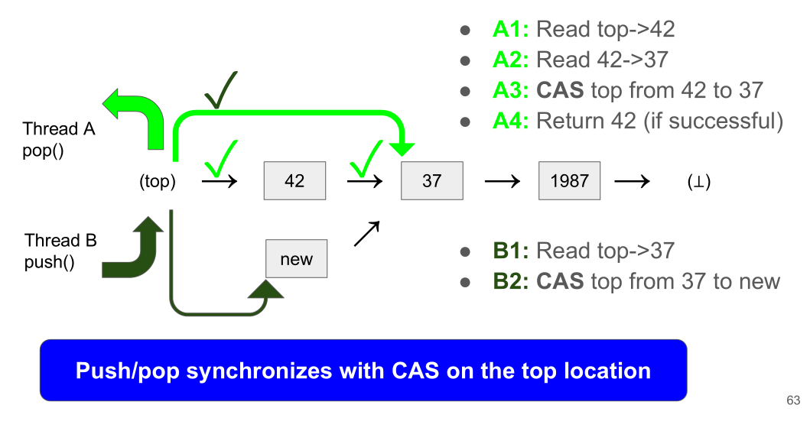
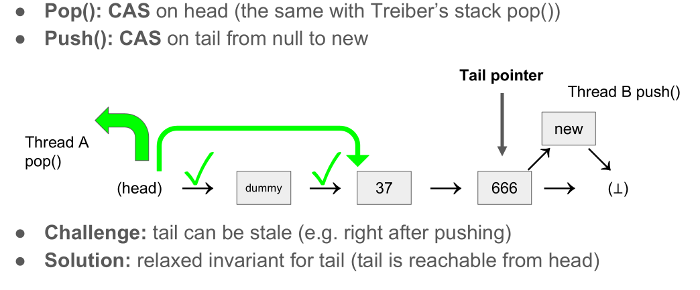

年初给自己2025年定的技术上的目标是继续深入研究Concurrent Programming，从整理自己已经学过的开始吧。
[cs431](https://github.com/kaist-cp/cs431) 这门课是去年年初看的，那时候正好在学rust，加上本身我对这些也感兴趣就头铁学习了一波，正好借此机会温习下课程内容，和自己学的其他东西对照起来整理下。整体来说这课还是很适合自学的，除了github仓库以外，有[课件](https://docs.google.com/presentation/d/1NMg08N1LUNDPuMxNZ-UMbdH13p8LXgMM3esbWRMowhU/edit?slide=id.p#slide=id.p)，有[youtube视频](https://www.youtube.com/playlist?list=PL5aMzERQ_OZ9j40DJNlsem2qAGoFbfwb4)。我自己也做了大部分的[作业](https://github.com/jsjtxietian/ParallelComputing/tree/master/cs431)，感觉也是颇有收获。

## Lock-based concurrency

Lock-based shared-memory concurrency: at any moment, a location is accessed by a single agent. Why are locks “easy” ?
* Lock constrains thread interleaving to acquire/release points => No interleaving between acquire and release
* Lock removes instruction reordering => Threads are executed AS IF they are the same thread.
* **Lock reduces nondeterminism to the minimum.**

We want an easy-to-use, always-safe high-level API

* **LockGuard** : RAII
* **Lock< T > (= (Lock, T)):** relating a lock and a resource with a new type

### Rust API

然后话题就到了Rust上，解释了下为啥是Best fit for this course: Rust’s type system based on **ownership** and **lifetime**,  the essence of concurrency (The principal challenge in the era of massive parallelism is managing **shared mutable states**). 之后正常介绍了下Rust：

* **Key ideas:**
  * **Discipline:** disallowing shared mutable accesses by default
  * **Interior mutability:** allowing them in a controlled way
* **Benefits:**
  * Statically analyzing the safety of shared mutable accesses (both for sequential and concurrent programs)
  * Explicitly marking those code that needs manual inspection

接着就是介绍了下Rust有哪些safe的api: Thread & ScopedThread, Arc, Send & Sync，Lock & LockGuard，Mutex & Condvar & RwLock, 以及crossbeam的一些api。也提供了之前的课件：[rust-school-2023-snu - Google Slides](https://docs.google.com/presentation/d/1LbiQ1Z3FTjp1144GRwEj3EPNj-RspAthlsq3a0PCQHw/edit?slide=id.g204abd30794_0_475#slide=id.g204abd30794_0_475)

### Lock

接下来是一些简单的实现，包括Spinlock, ticket lock, CLH lock, MCS lock, MCS parking lock等等。

TODO

### Fine-grained locking

TODO

看得出来老师很喜欢这篇paper：[When Concurrency Matters: Behaviour-Oriented Concurrency | Proceedings of the ACM on Programming Languages](https://dl.acm.org/doi/10.1145/3622852)，我准备在cs431的作业实现的部分整理。

### Managing multiple locks with BoC

论文在这里：[When Concurrency Matters: Behaviour-Oriented Concurrency | Proceedings of the ACM on Programming Languages](https://dl.acm.org/doi/10.1145/3622852)

### Optimistic locking

Observation: frequently, multiple operations are not conflicting with each other

Idea: optimistically assumes the success of operation, posthumously recovers

**Sequence lock** ( Optimistic reader-writer lock): [cs431/src/lock/seqlock.rs at main · kaist-cp/cs431](https://github.com/kaist-cp/cs431/blob/main/src/lock/seqlock.rs)

Writer: almost the same with spinlock

* Managing sequence number (usize) instead of lock flag (boolean)
* Even: consistent state between c.s., odd: inconsistent state inside c.s.
* E.g. W(0): acquires 0->1, releases 2,
          W(2): acquires 2->3, releases 4, ...

Reader: trying to read a consistent state (e.g. 2)

* Reading sequence number @ beginning & end (should be even & same)
* Req 1: W(0)’s end happens before R(2)’s beginning
* Req 2: R(2) doesn’t see W(2)’s writes as far as R(2) is validated

### Conclusion

**Performance drawbacks of fine-grained locking**:

* Write operations have heavy synchronization costs due to lock ops
* Read operations also writes to lock leading to cache invalidation

**Alternative 1**: advanced locks for read-mostly workloads: reader-writer lock (“Rust concurrency libraries”), optimistic locking, … (still unscalable for writers)

**Alternative 2**: “lock-free” concurrent data structures: 

* Pros: even better performance: Write operations have lightweight synchronization costs, Read operations perform just reads w/o cache invalidation
* Cons: much (×100) more difficult than lock-based concurrency…

## Lock-free concurrency

如果还要更好的性能，就要进入lock free的领域了。首先就是给定义 ( [Optimistic Locking Overview](https://dl.acm.org/citation.cfm?id=2183558) )：

* **Lock’s limitations**: no guarantee of progress
* **Lock freedom**: one of the ongoing operation is eventually completed, the whole system’s progress is guaranteed
* **Wait freedom**: every ongoing operation is eventually completed, example: [chaoran.me/assets/pdf/wfq-ppopp16.pdf](http://chaoran.me/assets/pdf/wfq-ppopp16.pdf)

Key idea for lock freedom是single-instruction commit. **Designating an RMW instruction as an operation’s commit point**: atomically reading from & writing to a location (e.g., CAS), single-instruction commit is RMW’s motivation!

### Data structures

#### Treiber’s stack

#### Michael-Scott’s queue

Push:

* Push 1: find the actual tail: Update the “tail” pointer if necessary
* Push 2: try to append a new node: If it fails, retry from the beginning
* Push 3: update the “tail” pointer:Perform a CAS from the old to the new tail. It’s okay to fail the CAS (we just want tail pointer is sufficiently recent)

Pop:

* Pop 1: update the “tail” pointer if it points to the dummy node.Ensure the head does not catch up to the tail. It’s okay to fail the CAS (we just want tail pointer is sufficiently recent)
* Pop 2: update the “head” pointer. Perform CAS from the old to the new head; If it fails, retry from the beginning

#### Sorted singly linked lists

Linked list whose nodes (consisting of key, value, next) are sorted by keys: https://github.com/kaist-cp/cs431/blob/main/src/lockfree/list.rs

* Finding a node: iterating list and finding the matching node. Used in lookup, insert, delete
* Deleting a node: 
  * Step 1: tagging its next pointer by 0x1 (logical deletion)
  * Step 2: detaching it in another iteration (physical deletion)
* Iteration strategies: how to deal with logically deleted nodes?
  * Harris’s: detaching consecutive logically deleted nodes at once
  * Harris-Michael’s: detaching logically deleted nodes individually
  * Harris-Herlihy-Shavit’s (wait-free): ignore logically deleted nodes. Can be used only for lookup (not insert/delete)

#### More

* Circular buffer: https://people.mpi-sws.org/~dreyer/papers/gps/paper.pdf
* Hash table, binary trees (AVL/red-black), radix trees, …
* Chase-Lev work-stealing deque
  * https://www.dre.vanderbilt.edu/~schmidt/PDF/work-stealing-dequeue.pdf
  * https://fzn.fr/readings/ppopp13.pdf
  * https://github.com/crossbeam-rs/crossbeam/tree/master/crossbeam-deque
  * https://github.com/jeehoonkang/crossbeam-rfcs/blob/deque-proof/text/2018-01-07-deque-proof.md

### Garbage collection

[[KAIST CS431, 2021 Fall\] Garbage Collection.pptx - Google Slides](https://docs.google.com/presentation/d/1cJhqCDQVo_R0RDRiRIyNqJQNBdQ8zAw-/edit?slide=id.p1#slide=id.p1)

### linearizability

对这个理论并没有看懂，

## Relaxed-memory behaviors

## Homework

[cs431/homework at main · kaist-cp/cs431](https://github.com/kaist-cp/cs431/tree/main/homework)
