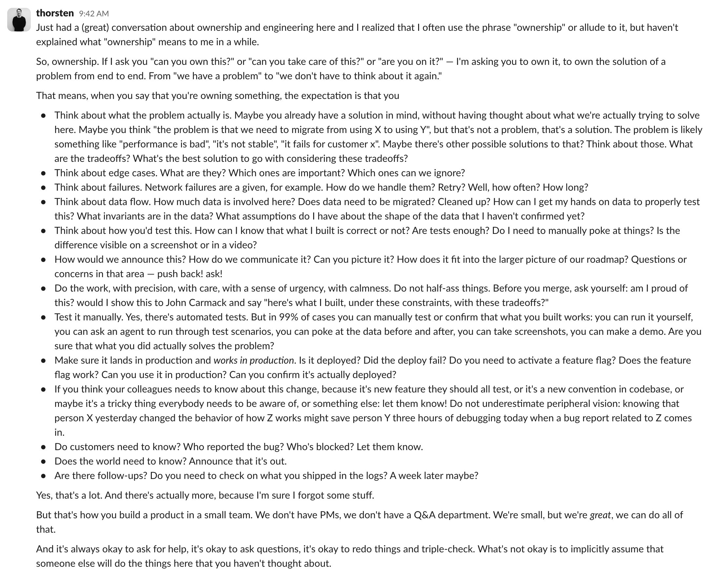

读不懂普鲁斯特，但读完了《从荷马到古希腊抒情诗》，开始下一个征程：刘象愚翻译的《尤利西斯》。确实是一直想读的一本书，但读着才发现确实难读，符号密度过大，一不留神就不知道作者在说啥了，当然留神了也会很痛苦。极为依赖注释，不然寸步难行。浓浓的爱尔兰氛围、希腊、圣经、文学元素等等，戏仿，我，躺平，反正有 AI，Gemini，出动吧。

打穿了《吸血鬼爬行者》，确实是不错的游戏，正反馈很强，10h 的超绝体验，每天一两把很舒服。FF7 Remake 玩到一半弃坑了，虽然我很喜欢爱丽丝的演出，但这个流程真的是又臭又长，导致我完全没有什么欲望去打下一部。然后最近没啥想玩的游戏了，唉。还好有猎人，都更新到 413 话了，这个叙事节奏真好，前天晚上甚至梦到了猎人。

又是大小周加班的一天，正好写写本 blog. 说实话最近在做的 AI 导演项目，虽然是有趣，也算是遇到了一些问题，比如做到现在，觉得很难再以低成本做出让人眼前一亮的效果了（受制于工期和算法的效果）；比如其实从几个相关的 partner 那边接到的期望和反馈有些区别，需要我自己想一想方向和人力安排。说实话我现在有点逃避这个思考的过程吧，我知道很重要，但总是下意识会不去想，把自己扎进实现中去，concrete 的代码、实现、优化给人一种安心的感觉——我在产出东西。然后正好在 X 上刷到一个帖子，是我很喜欢的一个博主的一段话，我贴在这里：

Own 一件事情确实是很难的，截图这里主要还是 focus 在技术讨论上，其实挺全面了。比如我接到一些对我的项目的需求，它合理吗，有必要吗，急吗，要和其他人同步吗，人力怎么安排，加人可以 scale 吗，等等。虽然我现在手下也没人，只有我自己这个人力以及俩算法好哥们，但我能感觉到这种张力。慢慢学吧，说不定过一个月这个项目就不用考虑这么多了，进入日常维护然后下一个了，害。

---

* OpenAI 的 GPT 5.6 系列模型正式发布了，Meta 发了 Muse Spark 1.1，SpaceXAI 发了 Grok 4.5，军备竞赛啊，就等你了 Gemini，不能只发个 [Gemma 4 Technical Report](https://arxiv.org/pdf/2607.02770) 啊。
* Perplexity 的 CEO [Aravind Srinivas](https://x.com/AravSrinivas/status/2075226438228402178): `We’ve been post-training a version of GLM that is trained to escalate to a frontier model inside the Computer harness.` 
* Anthropic 的新的可解释性研究也很有趣，我是看不懂这个 J-Space 的数学，但这里有关于 Qwen 的实验可以玩玩 [Jacobian Lens – Qwen3.6-27B ｜ Neuronpedia](https://www.neuronpedia.org/qwen3.6-27b/jlens).
* 最近总感觉自己没深度学啥东西，脑子要生锈了，就回去复习了下基础知识先，先从 3Blue1Brown 的视频开始：[How might LLMs store facts](https://www.youtube.com/watch?v=9-Jl0dxWQs8)，[But how do AI images and videos actually work](https://www.youtube.com/watch?v=iv-5mZ_9CPY&t=7s).
* 另外就是深度学习了下上次提到的 [MAI-Thinking-1: Building a Hill-Climbing Machine](https://microsoft.ai/pdf/mai-thinking-1.pdf)，很多看不懂的地方，但能看到这么详细的 cookbook 是真的不错啊。几个印象：1，Scaling Ladder 的方式，很严谨；2，收集、清洗、去重数据真是麻烦，数据配比也很有讲究：`Target = 0.5×Coding + 0.175×STEM + 0.175×Math + 0.1×General knowledge + 0.05×Multilingual`；3，顺序，pre-training，mid-training，然后 RL 里面也是先训练三个专家模型出来，然后用 SFT 来 distill 到一个模型，再最后 RL 一下。还是要多学习啊。

* 既有技术讨论，又火药味浓浓的论战：Jarred Sumner 写了 [Rewriting Bun in Rust](https://bun.com/blog/bun-in-rust) 以及 Zig 作者 Andrew Kelley 的回应 [My Thoughts on the Bun Rust Rewrite](https://andrewkelley.me/post/my-thoughts-bun-rust-rewrite.html). 说实话自从我比较关注 AI 这块之后，已经完全不太关注语言圣战了，啥语言合适 + AI 啥语言强我就用啥哈哈。不过这讨论里面还是有一些有趣的东西的，比如即使是 Fable + 比较完善的 test suite，写这种大项目也是 `Mechanically port every .zig file to a .rs file, matching the PORTING.md and LIFETIMES.tsv`，而不是放飞让 AI 直接去写；以及这里算账：`Pre-merge, this took 5.9 billion uncached input tokens, 690 million output tokens, and 72 billion cached input token reads — around $165,000 at API pricing. By hand, I think this would've taken 3 engineers with full context on the codebase about a year... We never would've done that.`再次印证了之前那句话：`Things that were impossible five months ago are now “just” Very Expensive.`
* 与时俱进的 CMU 下半年要开 Agent 课程了，[11-768 · AI Agents](https://www.cmu-agents.com/#/schedule)，可关注。
* 与时俱进的 SuperLuminal 发了 Linux 支持和 AI 支持，[Superluminal AI Support | Data-Driven AI At Superluminal Speed](https://superluminal.eu/applications/ai/)。

* 发现的一个还不错的小 skill，独立游戏有用 [agent-sprite-forge: Agent Skill for generating 2D sprite sheets and map, transparent PNG frames, and animated GIFs from prompts.](https://github.com/0x0funky/agent-sprite-forge/tree/main)
* tison 哥的新文章，力荐，[夜天之书 #120 掉进兔子洞：开源作为生活方式](https://mp.weixin.qq.com/s/UEnHM0-NWTEt31oSJ-IMNw)。
* 传统技术，[A deep dive into SmallVector::push_back | MaskRay](https://maskray.me/blog/2026-06-27-a-deep-dive-into-smallvector-push-back)；这个也不错，[CopySanitizer (CSan): Detecting unneccessary object copies at runtime - IR & Optimizations - LLVM Discussion Forums](https://discourse.llvm.org/t/rfc-copysanitizer-csan-detecting-unneccessary-object-copies-at-runtime/91038)

* 云风大佬又在 X 上“引爆”了一场关于微信数据存储方式的[论战](https://x.com/cloudwu/status/2071533904977428611)，说实话讨论技术还挺有趣的。不过就我观察，其实很多网友都没看完两方的全部言论就开始喷了，我就 emmmm，反正我也不懂，就学习吧。

* 股市就更有趣了，我又因为一些脑子上头的原因，满仓吃了半导体的大暴跌还没跑。仿佛是我刚体会到半导体要跌了再买并付诸实践，市场就教育我抄底是有概率会死的哈哈。至少我对自己的耐受线有一个大概的估计了，基本就是亏损 10-20% 的时候，会开始一直想这个事情，情绪不稳。所以为了我晚上能睡好，要果断止损；因为会果断止损，买入点一定是要选好，延伸形态下买入一定要慎重。

