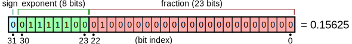
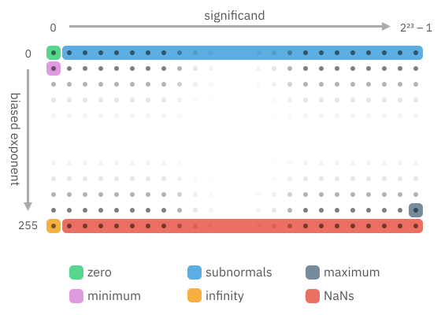
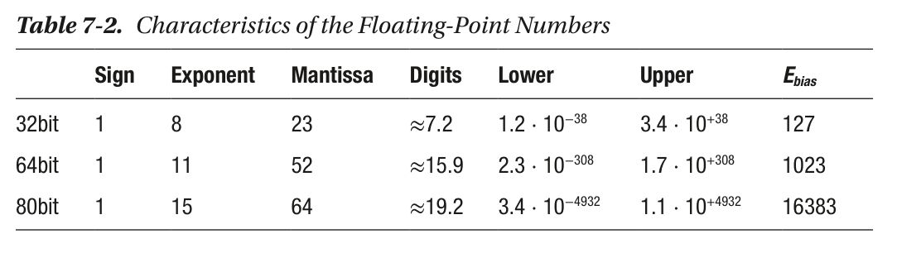
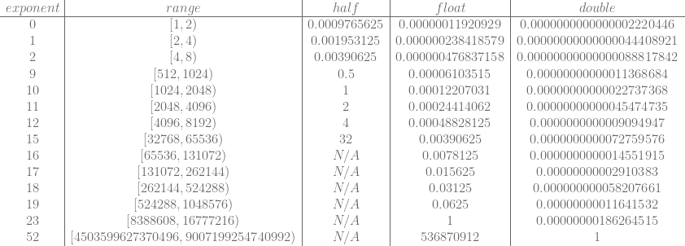

关于浮点数的一些记录。


## 浮点数表示

[Single-precision floating-point format](https://en.wikipedia.org/wiki/Single-precision_floating-point_format) The bits are laid out as follows:




公式：


图见[Exposing Floating Point – Bartosz Ciechanowski](https://ciechanow.ski/exposing-floating-point/)



* denormal or subnormal values: when all exponent bits are zero, the formula changes to: (−1)<sup>s</sup> × 0.m × 2<sup>1-bias</sup> (bias = 127 for 32bit)
  * `x` and `y` can be normal float but `x - y` is subnormal. If it wasn’t for subnormals the difference after rounding would be equal to 0, thus implying the equality of not equal numbers.

* floats have both +0.0 and -0.0 => `0.0 == -0.0` is true even though the two zeros have different encoding. Additionally, `-0.0 + 0.0` is equal to `0.0`, so by default the compiler can’t optimize `a + 0.0` into just `a`, [performance - What does gcc's ffast-math actually do? - Stack Overflow](https://stackoverflow.com/questions/7420665/what-does-gccs-ffast-math-actually-do/22135559#22135559)
* when all exponent bits are one:
  * Mantissa = 0 => Infinity
  * Mantissa ≠ 0 => NaN => By default the result of any operation involving NaNs will result in a NaN as well. NaNs are not equal to anything, even to themselves.




`bfloat16` is  a 16-bit floating point number type with a much smaller range and precision than the IEEE-standard `float32` type, making it much faster to compute with. The `bfloat16` is much easier to convert to and from `float32` than `float16` is -- it's just a single bit shift, because its exponent takes the same number of bits.


### 一种直观的理解方式

[Pro .NET Benchmarking](https://aakinshin.net/prodotnetbenchmarking/) 这本书提到的 Sanglard interpretation: **a floating-point number is represented by a sign, a window between two consecutive powers of two, and an offset within that window.** All numbers can be splitted into nonoverlapped intervals (windows): [0.125;0.25), [0.25; 0.5), [0.5; 1), [1; 2), [2; 4), and so on. Each window also can be split into nonoverlapped subintervals (buckets). 

If we want to convert a number to the IEEE 754 notation, we should find the window that contains this number. The index of the window is the exponent value. Next, we should find the bucket inside the window that contains the number. The bucket index (offset) is the mantissa value. If the number is negative, we should do the same for the absolute value of this number and put 1 in the sign bit.

例子：
0 10011100 11011100110101100101001
* 符号位：0
* 指数位：156，E − Ebias = 156 − 127 = 29 **=>** Window is [2<sup>29</sup>; 2<sup>30</sup>]
* 小数位：7236393 **=>** Window 被分割为 2<sup>23</sup>个 bucket，该数的 bucket index 为 7236393
* Window 范围为[536,870,912; 1,073,741,824]，按照 2<sup>23</sup>个 bucket 切割，每个 bucket 为 64
* 最后结果：536870912 + 64 * 7236393 = 1000000064

[Floating Point Visually Explained](https://fabiensanglard.net/floating_point_visually_explained/) 这里有另外的例子，用这种方法表示 6.1：


* Incrementing the integer representation of the maximum `float` value by one => You get infinity. 
* Decrementing the integer form of the minimum `float` => You enter the world of subnormals. 
* Decrease it for the smallest subnormal => You get zero. 
* Things fall into place just perfectly. The two caveats with this trick is that it won’t jump from +0.0 to −0.0 and vice versa.

[Onboarding floating-point](https://www.altdevarts.com/p/onboarding-floating-point) 系列也提到了类似的思路，从定点数讲到如何理解浮点数，浮点数作为压缩等等。


### Storing Integers

a floating point number can EXACTLY store all integers from -2<sup>MantissaBits+1</sup> to 2<sup>MantissaBits+1</sup>

见 [types - Which is the first integer that an IEEE 754 float is incapable of representing exactly? - Stack Overflow](https://stackoverflow.com/questions/3793838/which-is-the-first-integer-that-an-ieee-754-float-is-incapable-of-representing-e)

* For half floats that means you can store all integers between (and including) -2048 to +2048.
* For floats, it’s -16,777,216 to +16,777,216  
* For doubles it’s -9,007,199,254,740,992 to +9,007,199,254,740,992 => Doubles can in fact exactly represent any 32 bit unsigned integer, since 2^32 = 4,294,967,296.


## 精度问题

[Demystifying Floating Point Precision](https://blog.demofox.org/2017/11/21/)

Here’s a table showing the amount of precision you get with each data type at various exponent values. N/A is used when an exponent is out of range for the specific data type.



A half float has a maximum exponent of 15, the precision is 32 which is the smallest step that can be made in a half float at that scale. That range includes the smaller number but not the larger number. That means that the largest number a half float can store is one step away (32) from the high side of that range. So, the largest number that can be stored is 65536 – 32 = **65504**.

* Floating point numbers have between 6 and 7 digits of precision, regardless of exponent.
* Half floats have 10 mantissa bits and 2^10 = 1024, so they just barely have 3 digits of precision.
* Doubles have 52 mantissa bits and 2^52 = 4,503,599,627,370,496. That means doubles have between 15 and 16 digits of precision.


### 例 1，游戏时间

一个例子，如果记录游戏时间，每帧 +0.0333，什么时候 float 开始失效：

* floating point numbers have a precision of 0.03125 at exponent value 18. So, exponent 18 is close, but it’s precision is smaller than what we want – aka the precision is still ok.
* things break down at exponent 19, which has precision of 0.0625. Time is actually moving almost twice as fast in this case!
* At exponent 20, we start at 1056576.00 and adding 1/30 doesn’t even change the value. Time is now stopped.

**When will I hit precision issues** => `value = pow(2, ceil(log2(mantissa * precision))`


另一个例子，[A matter of precision](https://tomforsyth1000.github.io/blog.wiki.html#[[A%20matter%20of%20precision]])中提到的记录绝对时间：

if you are doing any sort of precise timing - physics, animation, sound playback - you need not just good precision, but totally reliable precision, because there tend to be a bunch of epsilons that need tuning. You're almost always taking deltas between absolute times, e.g. the current time and the time an animation started, or when a sound was triggered. Everything works fine in your game for the first five minutes, because absolute time probably started at zero, so you're getting lots of precision. But play it for four hours, and now everything's really jinky and jittery. **The reason is that four hours is right about 2^24 milliseconds, so you're running out of float precision for anything measured in milliseconds**, which is why physics and sound are particularly susceptible - but almost any motion in a game will show this jittering.

- Don't start your times at zero. Start them at something big. Ideally do the same with position - by default set your origin a long way away.
- float32 has precision problems even in normal circumstances - you only get about seven digits of precision. float64 is a tricky beast to use in practice - writing "double" in C is not sufficient.
- Variable precision is a nightmare for reproducibility and testability - even float64. Any time you want to use doubles in a game, you probably haven't understood the algorithm.
- Fixed-point may be old, but it works well for absolute time and position.
- Help yourself guard against precision-cancellation problems by not exposing absolute time and position to most parts of your app. Any time you think you need them, you're almost certainly going about the problem wrong.

做应用也是一样的，这里就是一个例子：[Vjekoslav Krajačić on X: "Someone reported a bug where File Pilot becomes sluggish after a week of being open. I tried profiling it, but nothing seemed out of order. There was no sign of memory growth or anything like that. It turns out the issue was due to floating point precision, as the program's" / X](https://x.com/vkrajacic/status/1894868543901954072)


### 例 2，渲染

**Jitter**：The matrix multiply is operating on large values with sparse 32-bit floating-point representations. A small change in the object or viewer position may not result in any change as roundoff errors produce the same results, but then suddenly roundoff error jumps to the next representable value and the object appears to jitter.

**Jitter is view-dependent**: when the viewer is very close to an object, a pixel may cover less than a meter, or even a centimeter, and therefore, jittering artifacts are prominent. When the viewer is zoomed out, a pixel may cover hundreds of meters or more, and precision errors do not introduce enough jitter to shift entire pixels; therefore, jitter is not noticeable.

[A matter of precision](https://tomforsyth1000.github.io/blog.wiki.html#[[A%20matter%20of%20precision]])的解释：The most obvious place this happens in games is when you're storing world coodinates in standard float32s, and two objects get a decent way from the origin. The first thing you do in rendering is to subtract the camera's position from each object's position, and then send that all the way down the rendering pipeline. The rest all works fine, because everything is relative to the camera, it's that first subtraction that is the problem. For example, getting only six decimal digits of precision, if you're 10km from the origin (London is easily over 20km across), you'll only get about 1cm accuracy. Which doesn't sound that bad in a static screenshot, but as soon as things start moving, you can easily see this horrible jerkiness and quantisation.


**Depth Buffer Precision (z-fighting)**：the depth buffer cannot tell which object is in front of which. The artifacts tend to flicker as the viewer moves around. 

For orthographic projections, this usually isn’t a concern because the relationship between eye space z, z<sub>eye</sub>, and window space z, z<sub>window</sub>, is **linear**. In perspective projections, this relationship is **nonlinear**. Objects near the viewer have small z<sub>eye</sub>values, with plenty of potential z<sub>window</sub> values to map to, allowing the depth buffer to resolve visibility correctly. The farther away an object, the larger its z<sub>eye</sub>. Due to the nonlinear relationship, these z<sub>eye</sub>values have much less z<sub>window</sub>values to map to, so the depth buffer has trouble resolving visibility of distant objects close to each other, which creates z-fighting artifacts.


## 浮点数的比较

[Comparing Floating-Point Numbers Is Tricky](https://bitbashing.io/comparing-floats.html)

Since the result of every floating-point operation must be rounded to the nearest possible value, math doesn’t behave like it does with real numbers. 

The C standard library contains a `FLT_EPSILON`, equal to the difference between 1.0 and the value that follows it. For values smaller than 1, `FLT_EPSILON` quickly becomes too large to be useful. For values greater than 2, `FLT_EPSILON` is smaller than the distance between adjacent values, so `fabs(a - b) <= FLT_EPSILON` will always be false.

对于[Boost Floating-point Comparison - 1.63.0](https://www.boost.org/doc/libs/1_63_0/libs/math/doc/html/math_toolkit/float_comparison.html)，after removing template boilerplate and edge case handling for infinity and NaNs, they resemble:

```c++
float relative_difference(float a, float b)
{
    return fabs((a - b) / min(a, b));
}

float epsilon_difference(float a, float b)
{
    return relative_difference(a, b) /
           FLT_EPSILON;
}
```


引入 UPL 的概念： **units of least precision between inputs**.  Boost offers a function called `float_distance` to get the distance between values in ULPs, but it’s about an order of magnitude slower than the approaches discussed so far.

**Adjacent floats (of the same sign) have adjacent integer values when reinterpreted as such**（参考上文的理解方法）, calculating the ULPs between values :

```c++
int32_t ulpsDistance(const float a, const float b)
{
    // Save work if the floats are equal.
    // Also handles +0 == -0
    if (a == b) return 0;

    const auto max =
        std::numeric_limits<int32_t>::max();

    // Max distance for NaN
    if (isnan(a) || isnan(b)) return max;

    // If one's infinite and they're not equal, max distance.
    if (isinf(a) || isinf(b)) return max;

    int32_t ia, ib;
    memcpy(&ia, &a, sizeof(float));
    memcpy(&ib, &b, sizeof(float));

    // Don't compare differently-signed floats.
    if ((ia < 0) != (ib < 0)) return max;

    // Return the absolute value of the distance in ULPs.
    int32_t distance = ia - ib;
    if (distance < 0) distance = -distance;
    return distance;
}
```

Relative epsilons—including ULPs-based ones—don’t make sense around zero. The exponential nature of floats means that many more values are gathered there than anywhere else on the number line.

using it meaningfully is difficult:

```c++
bool nearlyEqual(float a, float b,
        float fixedEpsilon, int ulpsEpsilon)
{
    // Handle the near-zero case.
    const float difference = fabs(a - b);
    if (difference <= fixedEpsilon) return true;

    return ulpsDistance(a, b) <= ulpsEpsilon;
}
```

When comparing floating-point values, remember:

- `FLT_EPSILON`… isn’t float epsilon, except in the ranges [-2, -1] and [1, 2]. The distance between adjacent values depends on the values in question.
- When comparing to some known value—especially zero or values near it—use a fixed ϵ that makes sense for your calculations.
- When comparing non-zero values, some ULPs-based comparison is probably the best choice.
- When values could be anywhere on the number line, some hybrid of the two is needed. Choose epsilons carefully based on expected outputs.

### How Python Compares Floats and Ints

[How Python Compares Floats and Integers](https://blog.codingconfessions.com/p/how-python-compares-floats-and-ints)

Languages like C and Java implement implicit type promotion, converting integers to doubles and comparing them bit by bit. 

Python is unique in this respect. It has infinite precision integers, making type promotion unfeasible in many situations. Consequently, Python uses its specialized algorithm to compare these numbers, which itself has edge cases:

1. If both `v` and `w` are float objects, then Python simply compares their underlying double values.
2. However, if `w` is an integer object, then:
   1. If they have opposite signs then it’s sufficient to compare the signs.
   2. Else if `w` is a huge integer (Python has infinite precision ints) then also we can skip comparing the actual numbers because `w` is larger.
   3. Else if `w` fits within `48` bits or less, then Python converts `w` into a double, and then does a direct comparison between `v` and `w`’s double values.
   4. Else if the exponents of `v` and `w` in their normalized fraction form are not equal then it is sufficient to decide based on their exponents.
   5. Else, compare the actual numbers. To do this, split `v` into its integer and fraction parts and then compare `v`’s integer part with `w`. (While taking into account the fractional part of `v`).

why Python gives the result for `9007199254740993 == 9007199254740993.0` as `False`, because it sees this as a comparison between `9007199254740993` and `9007199254740992.0`.


## 跨平台计算同步

[从零开始实现浮点数跨平台确定性](https://zhuanlan.zhihu.com/p/682531986)：确保不同平台上，**每一步计算的每个 bit 都必须相同**。需要一套日志系统，尽量详尽地记录确定性系统中每一步中间结果。把那些浮点数们，使用二进制序列化库，写到磁盘上。


### 硬件差异

* older x86 with x87 instructions 内部浮点单元使用了 80 位精度（[Extended precision - Wikipedia](https://en.wikipedia.org/wiki/Extended_precision)）；主流硬件对 IEEE 754-2008 基本做到了支持，X64 和 arm64 支持，，SSE、AVX、NEON 同样支持 IEEE 754-2008，乃至 CUDA 也支持，并且 x64 浮点数默认 64 位内部精度。
* 特定指令：FMA（fused multiply–add）指令，即 C99 fmaf()，就不在 IEEE 规范内；还有 SSE 经典的_mm_rsqrt_ps() 倒数平方根指令，与 NEON 的对应版本有效数字位数不同
* IEEE 754-2008 保证了大部分浮点数确定性，但意外总是存在的，尤其在处理特殊值`+0.0`、`-0.0`、`NaN`的时候
* long double 问题，80 位还是 64 位：[long double - Wikipedia](https://en.wikipedia.org/wiki/Long_double)
* [std::simd - Rust](https://doc.rust-lang.org/std/simd/index.html)：Portable SIMD is consistent between targets, This has one notable exception: a handful of older architectures (e.g. armv7 and powerpc) **flush subnormal f32 values to zero**. On these architectures, subnormal f32 input values are replaced with zeros, and any operation producing subnormal f32 values produces zeros instead. This doesn’t affect most architectures or programs.、


### 编译器优化

* 浮点数不遵守结合律、分配律：指令重排、常量合并等优化，恰恰可以视为结合律、分配律的应用；编译器有可能将标量（FPU）版本的浮点数计算转化为矢量（SIMD）版本；对非常接近 0 的小数字执行 FTZ（flush-to-zero）优化；FMA（fused multiply–add）优化。以上优化都可能引入额外的不确定性。
* C/C++ 默认优化级别较高。需要手动关闭 fast-math，-ffp-model=precise（clang/gcc）、/fp:precise（MSVC）。还需手动关闭浮点数融合指令，即我们前文所述的 FMA 乘加指令、平方根倒数指令等，-ffp-contract=off（clang/gcc）、/fp:contract（MSVC VS2022 以上）。另外，在 Rust 中混编 C/C++ 时也要开启这些标签。


### 第三方库

* IEEE 规范了浮点数的基础运算，但没有规范 sin、cos、exp 等复杂函数。这导致了不同版本的 libc 中，它们的实现不保证相同（比如 MSVC 和 GCC 里就不同）。
* 整个确定性系统都不能依赖外部时间，乃至一切外部输入。随机数会出现在某些算法与容器中，如哈希表。
* libc 内置的 qsort 是不稳定的，不同实现的版本，可能导致两个值相等，内部字段不同的对象顺序颠倒。
* 序列化：推荐二进制序列化方案，拷字节引入的麻烦总是较少。Rust 推荐 rkyv、bincode。C/C++ 的 protobuf、messagepack 理论上可用


### 建议

[Jolt Physics: Jolt Physics](https://jrouwe.github.io/JoltPhysics/index.html#deterministic-simulation)提供了一些确定性的建议，并给出了确定性的代价：This will make the library **approximately 8% slower** but the simulation will be deterministic. The most important things to look out for in your own application:

- Compile your application mode in Precise mode (clang: -ffp-model=precise, MSVC: /fp:precise)
- Turn off floating point contract operations (clang: -ffp-contract=off)
- Make sure the FPU state is consistent across platforms / threads. Check the floating point rounding behavior (should be nearest). Check that the denormals are zero (DAZ) and flush to zero (FTZ) flags are set consistently.
- Do not use the standard trigonometry functions (`sin`, `cos` etc.) as they have different implementations on different platforms, use Jolt's functions ([Sin](https://jrouwe.github.io/JoltPhysics/_trigonometry_8h.html#a89091907eb3da97f690e324849d773cb), [Cos](https://jrouwe.github.io/JoltPhysics/_trigonometry_8h.html#a40fafb1c427199b6855d704fc79cd1cf) etc.).
- Do not use `std::sort` as it has a different implementation on different platforms, use [QuickSort](https://jrouwe.github.io/JoltPhysics/_quick_sort_8h.html#a09973cb7cb8a1e98a51005ecedaf6eff) instead.
- Do not use `std::push_heap` and `std::pop_heap` as it has a different implementation on different platforms when elements are equal, use [BinaryHeapPush](https://jrouwe.github.io/JoltPhysics/_binary_heap_8h.html#ad87bf12de089dabad479dd7535aa997e)/[BinaryHeapPop](https://jrouwe.github.io/JoltPhysics/_binary_heap_8h.html#aa90b54155ed2d5a542d7d693dc73e89b) instead.
- Do not use `std::hash` as it is also platform dependent, use [Hash](https://jrouwe.github.io/JoltPhysics/struct_hash.html) instead.


## 性能

* Floating point number division is faster than integer division because of the exponent part requires only a relatively cheap fixed-cost subtraction. [performance - Why float division is faster than integer division in c++? ](https://stackoverflow.com/questions/55832817/why-float-division-is-faster-than-integer-division-in-c#)
* Denormal numbers 的性能问题 [hardware-effects/floating-point](https://github.com/Kobzol/hardware-effects/tree/master/floating-point)


## More

* 工具：
  * 查看浮点数：[Float Exposed](https://float.exposed/0x4e6e0000)
  * [Float Toy (evanw.github.io)](https://evanw.github.io/float-toy/)

* 资料汇编：[Floating-point further reading - by Mike Acton - AltDevArts](https://www.altdevarts.com/p/floating-point-further-reading) 
* Links：[Exposing Floating Point – Bartosz Ciechanowski](https://ciechanow.ski/exposing-floating-point/)
* Links：[21 « November « 2017 « The blog at the bottom of the sea](https://blog.demofox.org/2017/11/21/)
* boost 的文档：[Floating-point Comparison - 1.63.0](https://www.boost.org/doc/libs/1_63_0/libs/math/doc/html/math_toolkit/float_comparison.html)


## TODO

- [cbloom rants: Float to int casts for data compression](http://cbloomrants.blogspot.com/2023/07/float-to-int-casts-for-data-compression.html)
- [Beware of fast-math](https://simonbyrne.github.io/notes/fastmath/)
- [Float Compression 0: Intro · Aras' website (aras-p.info)](https://aras-p.info/blog/2023/01/29/Float-Compression-0-Intro/)
- [Managing Rounding Error (pbr-book.org)](https://pbr-book.org/3ed-2018/Shapes/Managing_Rounding_Error)
- [Comparing Floating Point Numbers, 2012 Edition | Random ASCII – tech blog of Bruce Dawson (wordpress.com)](https://randomascii.wordpress.com/2012/02/25/comparing-floating-point-numbers-2012-edition/)
- [What Every Computer Scientist Should Know About Floating-Point Arithmetic (oracle.com)](https://docs.oracle.com/cd/E19957-01/806-3568/ncg_goldberg.html)
- [Intermediate Floating-Point Precision | Random ASCII – tech blog of Bruce Dawson](https://randomascii.wordpress.com/2012/03/21/intermediate-floating-point-precision/)
- gpgpu for science：Round，fp16
- 定点数
- [The pitfalls of verifying floating-point computations](https://hal.science/file/index/docid/281429/filename/floating-point-article.pdf)
- pro .net benchmark 的其他问题性能
- [the secret life of NaN](https://anniecherkaev.com/the-secret-life-of-nan)
- [c - Printf width specifier to maintain precision of floating-point value - Stack Overflow](https://stackoverflow.com/questions/16839658/printf-width-specifier-to-maintain-precision-of-floating-point-value/19897395#19897395)
- [Hexadecimal Floating-Point Constants - Exploring Binary](https://www.exploringbinary.com/hexadecimal-floating-point-constants/)
- [Floating Point | Random ASCII – tech blog of Bruce Dawson](https://randomascii.wordpress.com/category/floating-point/)
- fp16 渲染：[Sebastian Aaltonen on X: "Physically correct direct sun light (day) is 100,000 lux. fp16 maximum value is 65504.0. fp10 and fp11 have also 5 bit mantissa, so their range is the same. Do people pre-expose their lights to fit into fp16?" / X](https://x.com/SebAaltonen/status/1727247423385526323)
- [Float Precision Revisited: Nine Digit Float Portability | Random ASCII – tech blog of Bruce Dawson](https://randomascii.wordpress.com/2013/02/07/float-precision-revisited-nine-digit-float-portability/)
- [dtolnay/ryu: Fast floating point to string conversion](https://github.com/dtolnay/ryu)
