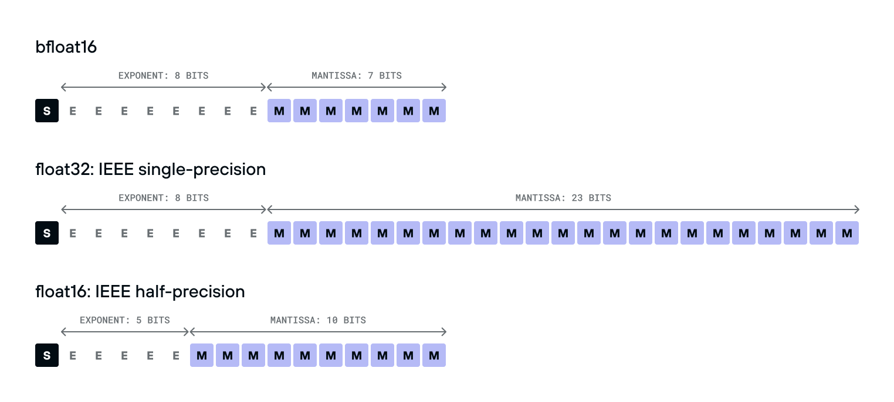

关于浮点数的一些记录。


## 浮点数表示

[Single-precision floating-point format](https://en.wikipedia.org/wiki/Single-precision_floating-point_format) The bits are laid out as follows:


公式：


* denormal or subnormal values: when all exponent bits are zero, the formula changes to: (−1)<sup>s</sup> × 0.m × 2<sup>1-bias</sup>
* floats have both +0.0 and -0.0
* when all exponent bits are one:
  * Mantissa = 0 => ∞
  * Mantissa ≠ 0 => NaN


`bfloat16` is  a 16-bit floating point number type with a much smaller range and precision than the IEEE-standard `float32` type, making it much faster to compute with. The `bfloat16` is much easier to convert to and from `float32` than `float16` is -- it's just a single bit shift, because its exponent takes the same number of bits.




### 一种直观的理解方式

[Pro .NET Benchmarking](https://aakinshin.net/prodotnetbenchmarking/) 这本书提到的Sanglard interpretation: **a floating-point number is represented by a sign, a window between two consecutive powers of two, and an offset within that window.** All numbers can be splitted into nonoverlapped intervals (windows): [0.125;0.25), [0.25; 0.5), [0.5; 1), [1; 2), [2; 4), and so on. Each window also can be split into nonoverlapped subintervals (buckets). 

If we want to convert a number to the IEEE 754 notation, we should find the window that contains this number. The index of the window is the exponent value. Next, we should find the bucket inside the window that contains the number. The bucket index (offset) is the mantissa value. If the number is negative, we should do the same for the absolute value of this number and put 1 in the sign bit.

例子：
0 10011100 11011100110101100101001
* 符号位：0
* 指数位：156，E − Ebias = 156 − 127 = 29 **=>** Window is [2<sup>29</sup>; 2<sup>30</sup>]
* 小数位：7236393 **=>** Window被分割为2<sup>23</sup>个bucket，该数的bucket index为7236393
* Window范围为[536,870,912; 1,073,741,824]，按照2<sup>23</sup>个bucket切割，每个bucket为64
* 最后结果：536870912 + 64 * 7236393 = 1000000064

[Floating Point Visually Explained](https://fabiensanglard.net/floating_point_visually_explained/) 这里有另外的例子，用这种方法表示6.1：


[Onboarding floating-point](https://www.altdevarts.com/p/onboarding-floating-point) 系列也提到了类似的思路，从定点数讲到如何理解浮点数，浮点数作为压缩等等。


## 比较

[Comparing Floating-Point Numbers Is Tricky](https://bitbashing.io/comparing-floats.html)

Since the result of every floating-point operation must be rounded to the nearest possible value, math doesn’t behave like it does with real numbers. 

The C standard library contains a `FLT_EPSILON`, equal to the difference between 1.0 and the value that follows it. For values smaller than 1, `FLT_EPSILON` quickly becomes too large to be useful. For values greater than 2, `FLT_EPSILON` is smaller than the distance between adjacent values, so `fabs(a - b) <= FLT_EPSILON` will always be false.

对于[Boost Floating-point Comparison - 1.63.0](https://www.boost.org/doc/libs/1_63_0/libs/math/doc/html/math_toolkit/float_comparison.html)，after removing template boilerplate and edge case handling for infinity and NaNs, they resemble:

```c++
float relative_difference(float a, float b)
{
    return fabs((a - b) / min(a, b));
}

float epsilon_difference(float a, float b)
{
    return relative_difference(a, b) /
           FLT_EPSILON;
}
```


引入UPL的概念： **units of least precision between inputs**.  Boost offers a function called `float_distance` to get the distance between values in ULPs, but it’s about an order of magnitude slower than the approaches discussed so far.

**Adjacent floats (of the same sign) have adjacent integer values when reinterpreted as such**（参考上文的理解方法）, calculating the ULPs between values :

```c++
int32_t ulpsDistance(const float a, const float b)
{
    // Save work if the floats are equal.
    // Also handles +0 == -0
    if (a == b) return 0;

    const auto max =
        std::numeric_limits<int32_t>::max();

    // Max distance for NaN
    if (isnan(a) || isnan(b)) return max;

    // If one's infinite and they're not equal, max distance.
    if (isinf(a) || isinf(b)) return max;

    int32_t ia, ib;
    memcpy(&ia, &a, sizeof(float));
    memcpy(&ib, &b, sizeof(float));

    // Don't compare differently-signed floats.
    if ((ia < 0) != (ib < 0)) return max;

    // Return the absolute value of the distance in ULPs.
    int32_t distance = ia - ib;
    if (distance < 0) distance = -distance;
    return distance;
}
```

Relative epsilons—including ULPs-based ones—don’t make sense around zero. The exponential nature of floats means that many more values are gathered there than anywhere else on the number line.

using it meaningfully is difficult:

```c++
bool nearlyEqual(float a, float b,
        float fixedEpsilon, int ulpsEpsilon)
{
    // Handle the near-zero case.
    const float difference = fabs(a - b);
    if (difference <= fixedEpsilon) return true;

    return ulpsDistance(a, b) <= ulpsEpsilon;
}
```

When comparing floating-point values, remember:

- `FLT_EPSILON`… isn’t float epsilon, except in the ranges [-2, -1] and [1, 2]. The distance between adjacent values depends on the values in question.
- When comparing to some known value—especially zero or values near it—use a fixed ϵ that makes sense for your calculations.
- When comparing non-zero values, some ULPs-based comparison is probably the best choice.
- When values could be anywhere on the number line, some hybrid of the two is needed. Choose epsilons carefully based on expected outputs.

### How Python Compares Floats and Ints

[How Python Compares Floats and Integers](https://blog.codingconfessions.com/p/how-python-compares-floats-and-ints)

Languages like C and Java implement implicit type promotion, converting integers to doubles and comparing them bit by bit. 

Python is unique in this respect. It has infinite precision integers, making type promotion unfeasible in many situations. Consequently, Python uses its specialized algorithm to compare these numbers, which itself has edge cases:

1. If both `v` and `w` are float objects, then Python simply compares their underlying double values.
2. However, if `w` is an integer object, then:
   1. If they have opposite signs then it’s sufficient to compare the signs.
   2. Else if `w` is a huge integer (Python has infinite precision ints) then also we can skip comparing the actual numbers because `w` is larger.
   3. Else if `w` fits within `48` bits or less, then Python converts `w` into a double, and then does a direct comparison between `v` and `w`’s double values.
   4. Else if the exponents of `v` and `w` in their normalized fraction form are not equal then it is sufficient to decide based on their exponents.
   5. Else, compare the actual numbers. To do this, split `v` into its integer and fraction parts and then compare `v`’s integer part with `w`. (While taking into account the fractional part of `v`).

why Python gives the result for `9007199254740993 == 9007199254740993.0` as `False`, because it sees this as a comparison between `9007199254740993` and `9007199254740992.0`.


## 性能

* Floating point number division is faster than integer division because of the exponent part requires only a relatively cheap fixed-cost subtraction. [performance - Why float division is faster than integer division in c++? ](https://stackoverflow.com/questions/55832817/why-float-division-is-faster-than-integer-division-in-c#)
* Denormal numbers的性能问题 [hardware-effects/floating-point](https://github.com/Kobzol/hardware-effects/tree/master/floating-point)


## 工具

* 查看浮点数：[Float Exposed](https://float.exposed/0x4e6e0000)
* [Float Toy (evanw.github.io)](https://evanw.github.io/float-toy/)


## More

* 资料汇编：[Floating-point further reading - by Mike Acton - AltDevArts](https://www.altdevarts.com/p/floating-point-further-reading) 
* boost的文档：[Floating-point Comparison - 1.63.0](https://www.boost.org/doc/libs/1_63_0/libs/math/doc/html/math_toolkit/float_comparison.html)


## TODO

* [从零开始实现浮点数跨平台确定性（帧同步） - 知乎 (zhihu.com)](https://zhuanlan.zhihu.com/p/682531986)

- [cbloom rants: Float to int casts for data compression](http://cbloomrants.blogspot.com/2023/07/float-to-int-casts-for-data-compression.html)
- [Float Compression 0: Intro · Aras' website (aras-p.info)](https://aras-p.info/blog/2023/01/29/Float-Compression-0-Intro/)
- [Exposing Floating Point – Bartosz Ciechanowski](https://ciechanow.ski/exposing-floating-point/)
- [Managing Rounding Error (pbr-book.org)](https://pbr-book.org/3ed-2018/Shapes/Managing_Rounding_Error)
- Demystifying Floating Point Precision[21 « November « 2017 « The blog at the bottom of the sea (demofox.org)](https://blog.demofox.org/2017/11/21/)
- [Comparing Floating Point Numbers, 2012 Edition | Random ASCII – tech blog of Bruce Dawson (wordpress.com)](https://randomascii.wordpress.com/2012/02/25/comparing-floating-point-numbers-2012-edition/)
- [What Every Computer Scientist Should Know About Floating-Point Arithmetic (oracle.com)](https://docs.oracle.com/cd/E19957-01/806-3568/ncg_goldberg.html)
- gpgpu for science
- round
- 压缩
- fp16 渲染
- 定点数 浮点数
- 转化 float  Converting a Floating-Point Number to IEEE-754 Format
- TODO：pro .net benchmark的其他问题
