## 游戏优化的特点

* 游戏优化讲究的是在一帧的时间内，很快地完成1000件不同的事情。游戏性能最直观的标准是帧率，每帧时间越短，帧率自然越高。但是帧率本身是分层的目标：30帧，60帧，120帧等等。举个例子，如果frame pacing没处理好的话，不稳定的40帧的给玩家带来的体验是不如稳定的30帧的。
* 游戏本身的子系统相当多，但是Everything has a budget, and you need to keep to it so the game is playable. 卡顿非常影响体验，所以需要为最坏情况打算。
* 每个子系统的逻辑都有区别，很难有一招鲜吃遍天的情况，GPU相关的优化所需要的手段和CPU的就完全不同，都需要具体分析。
* 游戏项目一般时间紧迫，很多时候只能抓大放小，定位瓶颈然后制定计划优化。要考虑投入产出比，优化的风险（是否可热更）。优化是权衡的艺术，砍美术资源当然是最快的优化方案，但是会让美术、策划不高兴。

## 流程与工具

### 规范

* 整体：确定目标硬件和目标性能，硬件分档，制定每一档的性能目标。
* 美术：尽可能早设立和使用每一档的美术标准，包括地图、模型、贴图、特效（粒子）的制作规范等等，完善相应的资源静态与动态检查工具（特效性能检测工具、地图离线检测、自动跑图等）。
  * 进阶：美术提前按重要性分层，按照性能压力可以依次关闭不重要的显示效果。
* 代码：确立代码规范，静态代码分析工具，可以在提交代码前就报警：例如高频GC操作、在Update中打log等。

### Benchmark

* 定时自动性能测试（自动跑图、Replay等）并记录数据，发现明显的性能regression自动报警。
  * 进阶：可以有自动化的归因，例如发现了FPS的regression，可以自动diff出耗时变长的模块；发现内存变多，可以自动抓快照对比出变多的内存条目；启动/加载时间变长，自动对比分析出变长的原因。
* 定时资源轮播、对比：在目标机型上加载所有的资源，可以记录加载资源的耗时、内存等；可以进行不同版本之间的比较，资源数量的控制。

### 趁手工具

* 代码中尽早准备好相关的接口，可以做到按性能配置加载不同配置的资源、特效等
* GM开关，可以一键加载或关闭任意UI组件/地图区块/特效等，定位热点资源很有用；信息Panel，显示当前关键的性能数据
* 内网/本地热更机制 or 类似的加速迭代的机制 or 极快的打包速度，有利于修复性能问题时候的迭代速度
* 有一个强大的工具组，开发数个典型的性能测试场景（包括图形、脚本等等），并尽量保持跨版本的稳定性，可以当作性能测试与优化的playground
* 全自动化的性能对比机制，比如给一个包，指定某个机型，对比其打开关闭某个功能/开关之后的性能，自动形成性能报告提供给开发来分析。方便做某个活动开启 or 关闭的性能分析，或者是某个优化的效果对比。

## 他山之石

### Automated Testing and Profiling for Call of Duty

[Automated Testing and Profiling for Call of Duty - YouTube](https://www.youtube.com/watch?v=8d0wzyiikXM)

安利了buildbot，但是还是觉得不够好，自己写了一个叫compass的系统，负责打包、测试等。主要职责：

* **CI**（Triggers for every check-in, aim to complete < 30 minutes, multiple builds in parallel）：Compile game code and tools code；Converting assets；Running the game on 3-4 maps on all platforms；Other tests: Device Debug, Dedicated Server, Unit tests.
* **All Maps**（Complete < 1h, one build at a time）：Boot testing every map in the game.
* **Release Build**：Build a full packaged version of the game；These builds are sent to QA or can potentially be put on disc；Can take a while to complete
* **Branch Maintenance**：Automatic merge down from stable->less stable；Gated merges are managed from less stable -> stable ones

一目了然的可视化：

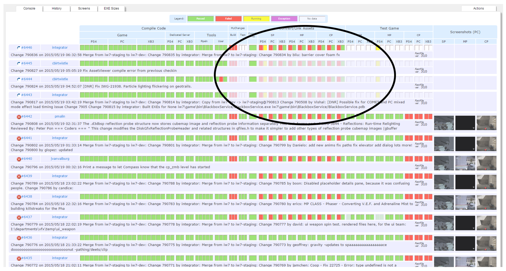

一些特点：

* 如果commit太多，build server会自动跳过一些task
* 可以把鼠标悬浮到红色的方块上直接预览报错是啥
* 自动测试自带截图，方便trouble shooting
* 把资源监控也集成到了管线中，例如，可以查看shader编译后的数量变化、资源分类大小等等，并且查看是哪条commit导致的变化
* Nightly性能监控：QA跑地图，记录下觉得卡的地方；Compass会自动把player传送到那些地方，静止30s，并且录制性能数据；悬浮可以预览截图与变化，点击方格可以去到详细信息

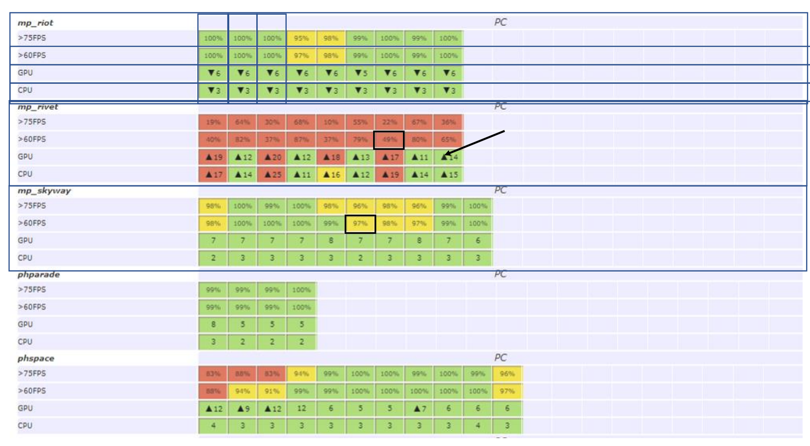

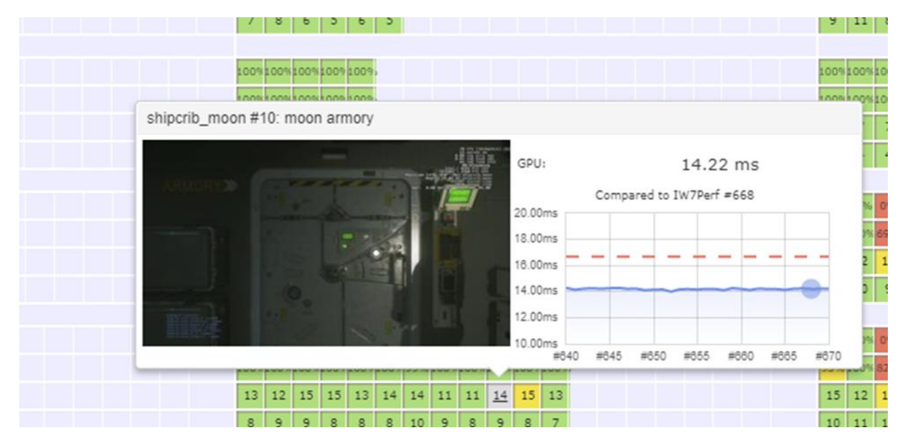

关于错误处理：

* Error Key，一句话总结失败原因；Error Bucket包含所有有相同的Error Key的task；Error Book，记录了所有build过程中遇到过的问题，方便trouble shoot
* Auto Retry，可以根据Error Bucket来配置

其他一些点：Compass Configuration as Code（Python），讨论了一些优劣点。利用Puppet来分发软件，考虑迁移到Windows Docker。Metrics tracking/graphing using InflusxDB/Grafana

### ENGINE OPTIMIZATION POWERED BY BIG DATA 

主要是在讲用大数据和AI加速找性能问题过程。尤其是在High level （SERVER MONITORING）和low level（Profiler数据）的信息之间，Is there a better way, a data analytics solution between high and low level.

目标：AUTOMATIZE REPORTING、DEMOCRATIZE INVESTIGATION

手段：Dashboard、Ad-Hoc analysis、Machine learning model

从这张图来看，他们的引擎似乎主要以Task为基础，而且Task可以关联到asset等信息，主要的信息就是以Task为基础，这应该极大方便了数据的收集与整合，也方便Profile。

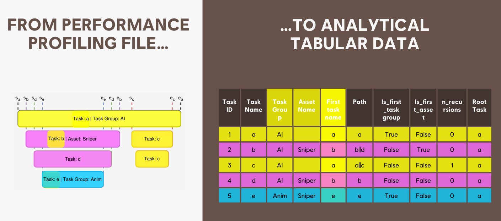

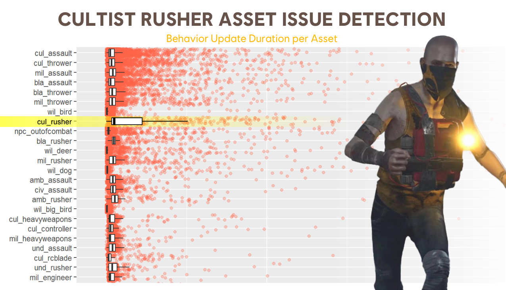

A performance analysis pipeline. 长期的数据收集：

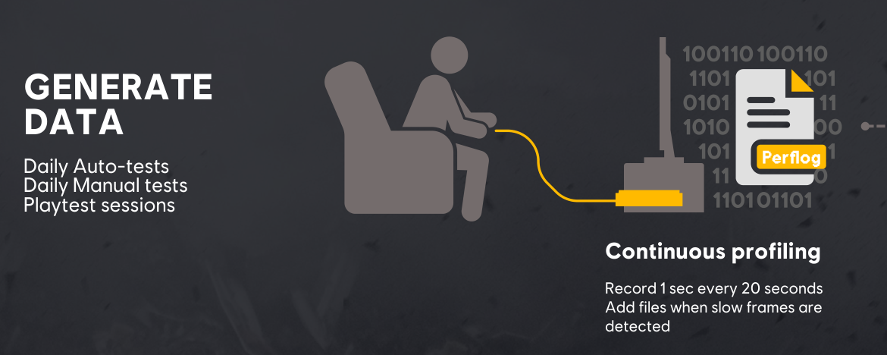

经过Data transformation，数据的保存也是分两份的：

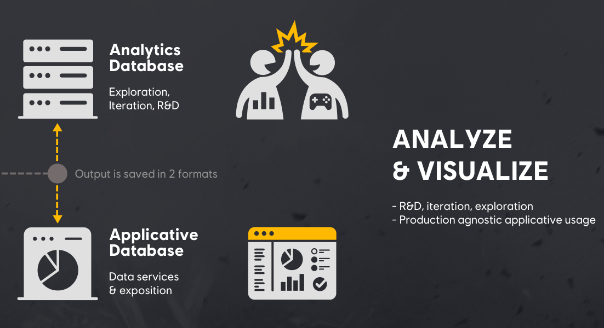

分析阶段，Dashboard也是以Task为基础，整体看着就很“数据分析”：

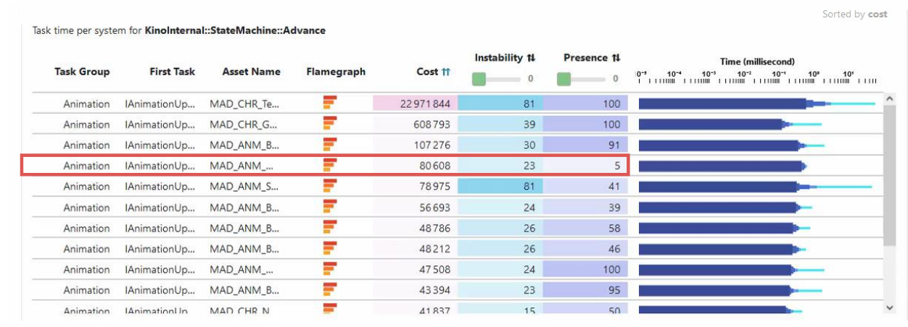

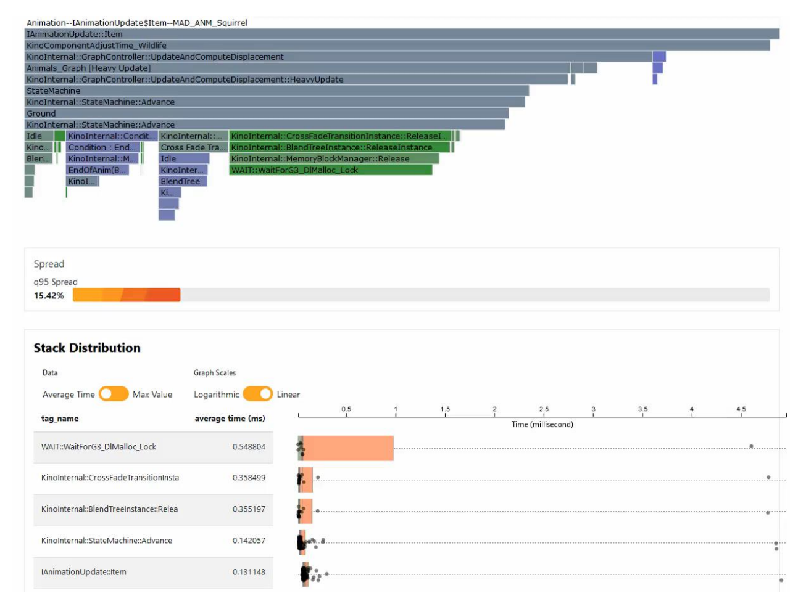

Asset projection，像是个Outlier检测，pinpoint what is costly and instable：

**MACHINE LEARNING USING CPU PROFILING DATA**：DASHBOARDS ARE GOOD FOR MONITORING，BUT ARE LIMITED TO PRIORITIZE OPTIMISATION EFFORTS

利用xAI来帮助专家 pinpoint the tasks that are delaying your frames：

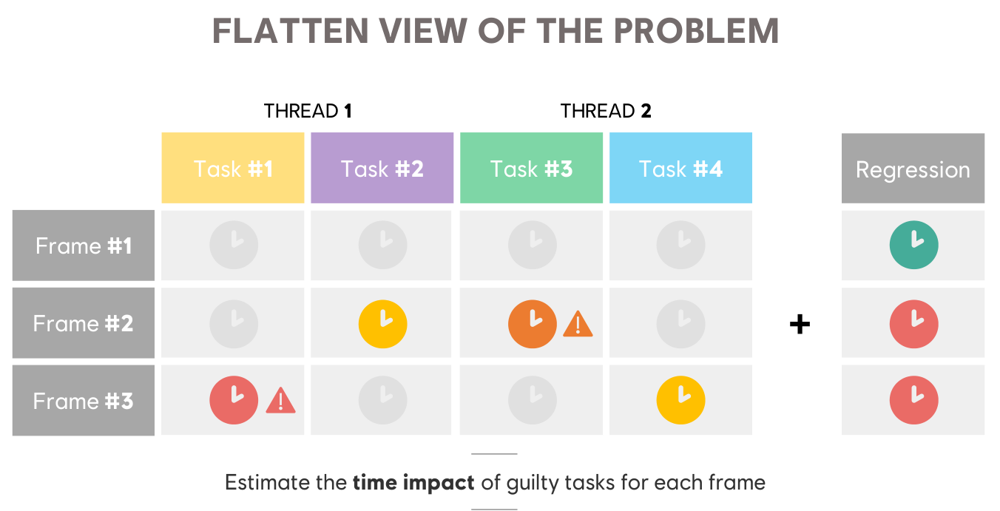

Train a neural network on tasks execution time, task lineage and children to predict by how much a given task would delay a frame. Dataset comes from years of manually annotated profiling files that engineers have collected, analyzed and proposed fixes for. Hyperparameters are updated Bi-monthly：

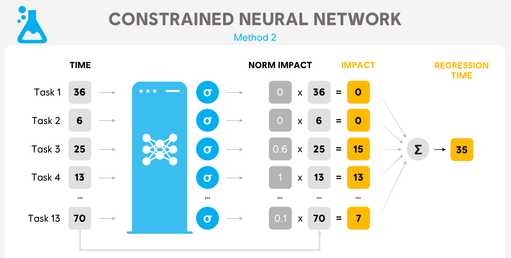

流程总结：

* When one of our play session contains a regression - or delay for a frame - a profiling file is collected and automatically analyzed.  
* We pass the task through the neural net to estimate each task's weight in the captured regression. 
* Using these weights, engineers know which tasks are the most likely to be causing the frame delay by increasing the e2e time of the critical path. 
* They can focus their time where it matters the most to reach the frame generation time.

也提到了这种情况下性能团队的Key roles：

* PERFORMANCE CHAMPION：Ensure data quality, check data availability, train the team
* ROJECT CHAMPION：Identify priorities, reports to core team about game’s health
* DATA ANALYST：Create custom dashboards & ad-hoc analysis

### PUSHING THE LIMITS OF VIDEO GAME PERFORMANCE

也提到了上一篇的管线，在这基础上进一步提问，可不可以predict the performance impact of a code change without actually profiling it & predict the likelihood that a given change will make us break our frame timing？因此引入了SZZ，讨论可不可以做SZZ-BASED PERFORMANCE PREDICTION，引了这篇paper：[Performance Prediction From Source Code Is Task and Domain Specific | IEEE Conference Publication | IEEE Xplore](https://ieeexplore.ieee.org/document/10174021)

后面转去讨论TASK SCHEDULER SELECTION，引了这篇paper：[Exploring Scheduling Algorithms for Parallel Task Graphs: A Modern Game Engine Case Study | SpringerLink](https://link.springer.com/chapter/10.1007/978-3-031-12597-3_7)

再后面就是利用AI的一些优化：

* ANIMATION：Learn the best axis and generate the animation
* Texture：AI-enhanced compression algorithms，见Learning End-to-End Lossy Image Compression: A Benchmark [Compression Benchmark](https://huzi96.github.io/compression-bench.html)
* FRAME UPSCALING & Generation：DLSS
* 网游中利用AI来预测玩家位置、用LSTM预测GS扩容

Takeaway：

* OPTIMIZATIONS HAVE TO BE DATA-DRIVEN. 
* SYSTEMS ARE TOO LARGE AND TOO COMPLEX
* MACHINE LEARNING PLAYS A KEY ROLE
* WHAT CAN I FIT IN 8MS. MINDSET SHIT FROM WHERE CAN I OPTIMIZE TO WHAT CAN I DO WITH THE GIVEN BUDGET.

### Automated Debug & Profiling of AAA Games

主要是提到了一些育碧内部自动化的努力。

也提到了上一篇中说的SZZ相关的，甚至做了个针对commit的风险模拟器，“In this tool, we see all the feature and their weight, either good or bad, towards the riskiness of introducing a new defect shown in the top-left corner”。后续还讨论了自动生成bugfix patch的可能方案。

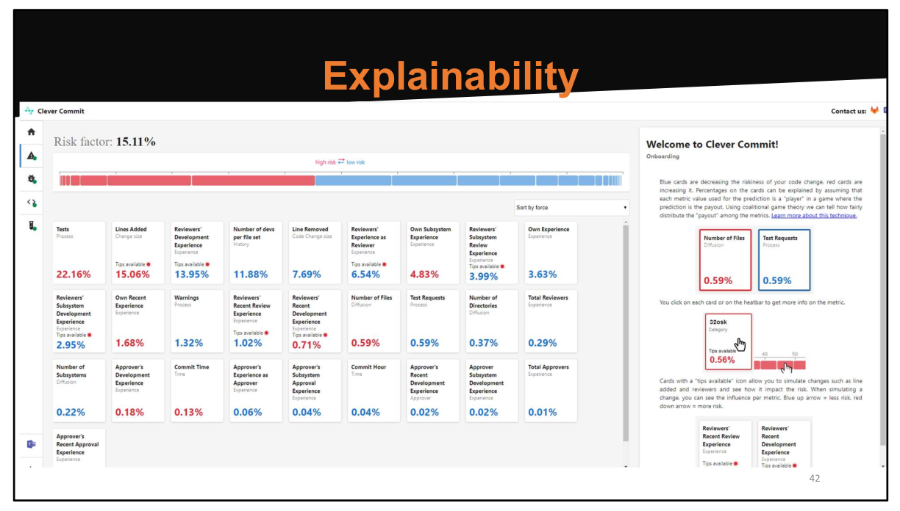

大数据加持下的**Manual Test**：summarizing past regressions that were introduced when the code changed by a commit was changed prior to that commit. It works by selecting the sentences in the jiras linked to buggy commit-regions. 这样可以辅助QA进行更加针对性地进行测试（code-changes => high level gameplay functionality that could be broken），也可以提醒开发者自己的改动有可能有哪些意外的风险。

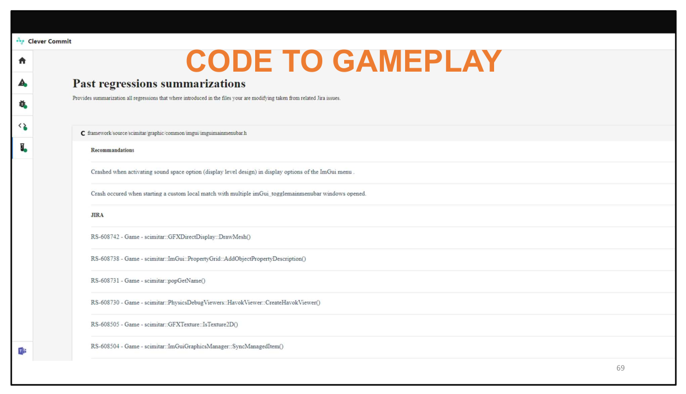

CI管线也是，可以利用静态分析分析出代码进行了哪些改动，用这个来指导QA的测试优先级。提了几个想法：是不是可以自动二分做包来查看哪个commit导致pipeline失败的，节约人力；speculative build/test batching，根据commit信息来猜测哪些build、测试比较重要，lower the number of builds while keeping a high level of confidence。

**BOT ASSISTED DEBUG**：train bot to play the game for us and report their findings. 利用CV、强化学习等技术，using the findings of the bot we can debug and profile our games. For instances slow-frames that the bot triggers can be further analyzed and the actions that the bot is taking towards victory are recorded.

最后讨论了下md5 + crash graph：把crash stack的md5码提取出来，相近的放进同一个bucket。引了两篇paper，《Crash graphs: An aggregated view of multiple crashes to improve crash triage》和《CrashLocator: locating crashing faults based on crash stacks》。

## 草稿

TODO:

* 游戏 + 动态追踪技术 ？ => 模仿帧同步的高性能log打点
* 关键指标的收集（影响性能的核心数据）

## 总结

欢迎提issue交流：[Issues · jsjtxietian/jsjtxietian.github.io](https://github.com/jsjtxietian/jsjtxietian.github.io/issues)

