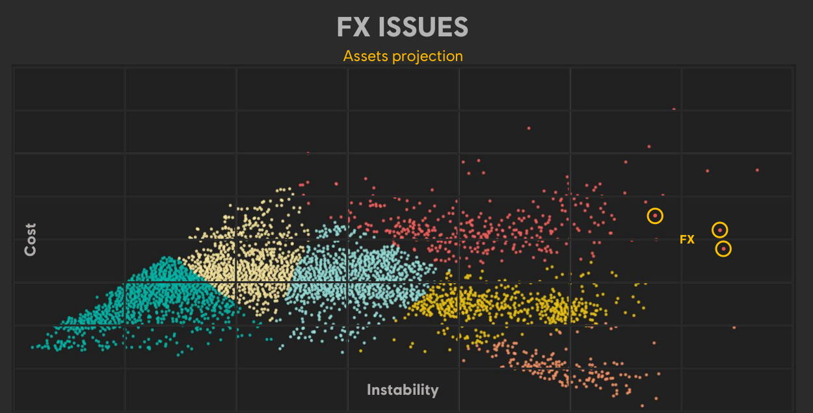

## 游戏优化的特点

* 游戏作为软实时软件，优化讲究的是在一帧的时间内，很快地完成1000件不同的事情。游戏性能最直观的标准是帧率，每帧时间越短，帧率自然越高。但是帧率本身是分层的目标：30帧，60帧，120帧等等。举个例子，如果frame pacing没处理好的话，不稳定的40帧的给玩家带来的体验是不如稳定的30帧的。
* 游戏本身的子系统相当多，但是Everything has a budget, and you need to keep to it so the game is playable. 卡顿非常影响体验，所以需要为最坏情况打算。
* 每个子系统的逻辑都有区别，很难有一招鲜吃遍天的情况，GPU相关的优化所需要的手段和CPU的就完全不同，都需要具体分析。
* 游戏项目一般时间紧迫，很多时候只能抓大放小，定位瓶颈然后制定计划优化。要考虑投入产出比，优化的风险（是否可热更）。优化是权衡的艺术，砍美术资源当然是最快的优化方案，但是会让美术、策划不高兴。


## 流程与工具

把复杂的事情简单化，简单的事情标准化，标准的事情流程化，流程的事情自动化。

比较切实的建议可以参考：[游戏性能优化全流程建设(Unity) - 知乎](https://zhuanlan.zhihu.com/p/692168575)

### 规范

* 整体：确定目标硬件和目标性能，硬件分档，制定每一档的性能目标。
* 美术：尽可能早设立和使用每一档的美术标准，包括地图、模型、贴图、特效（粒子）的制作规范等等，完善相应的资源静态与动态检查工具（特效性能检测工具、地图离线检测、自动跑图等）。
  * 进阶：美术提前按重要性分层，按照性能压力可以依次关闭不重要的显示效果。
* 代码：确立代码规范，静态代码分析工具，可以在提交代码前就报警：例如高频GC操作、在Update中打log等。


### Benchmark

* 定时自动性能测试（自动跑图、Replay等）并记录数据，发现明显的性能regression自动报警。
  * 进阶：可以有自动化的归因，例如发现了FPS的regression，可以自动diff出耗时变长的模块；发现内存变多，可以自动抓快照对比出变多的内存条目；启动/加载时间变长，自动对比分析出变长的原因。
  * 可以参考meta的工作，找subroutines的regression比较容易：[FBDetect: Catching Tiny Performance Regressions at Hyperscale through In-Production Monitoring](https://tangchq74.github.io/FBDetect-SOSP24.pdf)
* 定时资源轮播、对比：在目标机型上加载所有的资源，可以记录加载资源的耗时、内存等；可以进行不同版本之间的比较，资源数量的控制。


### 趁手工具

* 代码中尽早准备好相关的接口，可以做到按性能配置加载不同配置的资源、特效等
* GM开关，可以一键加载或关闭任意UI组件/地图区块/特效等，定位热点资源很有用；信息Panel，显示当前关键的性能数据
* 内网/本地热更机制 or 类似的加速迭代的机制 or 极快的打包速度，有利于修复性能问题时候的迭代速度
* 有一个强大的工具组，开发数个典型的性能测试场景（包括图形、脚本等等），并尽量保持跨版本的稳定性，可以当作性能测试与优化的playground
* 全自动化的性能对比机制，比如给一个包，指定某个机型，对比其打开关闭某个功能/开关之后的性能，自动形成性能报告提供给开发来分析。方便做某个活动开启 or 关闭的性能分析，或者是某个优化的效果对比。


## 动态分析——可观测性

我一直在思考能不能把Linux的动态追踪技术（[动态追踪技术漫谈 - OpenResty 官方博客](https://blog.openresty.com.cn/cn/dynamic-tracing/)）用到游戏引擎里。动态追踪技术通常是基于操作系统内核来实现的，对于游戏来说，游戏引擎就是其操作系统，那是不是可以基于游戏引擎实现一套类似的机制。

### 关于方法的思考

如果我现在发现游戏某个已经Ship的版本有性能问题，我可能有以下的解决方案：

* 依靠在游戏内的预先埋点所收集的信息来进行性能分析。但是埋点本身也存在问题，埋点多了会导致采集一些根本不需要的信息，从而造成不必要的采集和存储开销；埋点少了会导致缺乏关键信息，毕竟没人可以预知未来。
* 出dev（development）版本的包，配合对应的性能分析工具，希望可以在dev版本上重现已经ship的版本的性能问题。但是，一来这可能就导致环境的丢失从而难以复现，二来一般development版本的包的性能损失会很可观，显然并不适合对于在线游戏的实时活体分析。

那么参考动态追踪技术，对于游戏的活体分析而言：

* 目标：我希望能把整个游戏本身看成是一个可以直接查询的“数据库”，可以直接从这个“数据库”里安全快捷地得到我们想要的信息，而且绝不留痕迹，绝不去采集我们不需要的信息。可以随时进行采样，随时结束采样，而不用管目标系统的当前状态；保持自身的性能损耗极小，5%以内，而且即使是这么小的性能损耗也只发生在实际采样的那几十秒或者几分钟以内。
* 手段：在从游戏gameplay层到引擎到操作系统的某一个层次，或者某几个层次上面，安置一些tracepoint（Linux原本是安置探针，然后允许自定义这些探针所关联的处理程序，可能对游戏而言有些overkill，但是已经有一些尝试：[Low-level native plug-in Profiler API](https://docs.unity3d.com/2022.3/Documentation/Manual/LowLevelNativePluginProfiler.html)）。
* 方法：会把对最终问题的假设，分解成一系列的小假设，然后逐步求索，逐步验证，不断地调整方向和假设，以接近最终的问题。这样的优势在于，采样当中对系统产生的开销一直会相对较小，尽可能接近真实环境。有点类似TMAM法（[TMAM](https://jsjtxietian.github.io/2024/08/19/perf_single_core/#TMAM)），层层往下追，直到发现问题。往后也许可以考虑引入某种智能的自动化，自动使用系统性的方法，逐步缩小问题范围，直至定位问题根源，再报告给用户，并向用户建议优化或修复方法。

游戏的层级：

* 客户端层：一般的游戏都会有某种上报功能（如[Telemetry](https://www.gamedeveloper.com/design/game-telemetry-with-dna-tracking-on-assassin-s-creed)）来收集玩家的游玩相关的信息，这里提供的是在游戏的视角中，玩家在做什么的信息。
  * 脚本层：如果游戏是重脚本的，也应该将其置于该层级序列中。
* 引擎层：作为客户端的操作系统，这里是本节主要关注的地方。
* OS层：其实是[Perfetto](https://perfetto.dev/docs/tracing-101)等工具的领域，提供线程调度、cpu频率等信息。


### 关于实践的思考

以简单的render流程为例，我现在设想的代码大概长这样：

```c++
bool tracepoint_enabled_render;
bool tracepoint_enabled_render_cull;
// ... other cull related stage bool
bool tracepoint_enabled_render_opaque;
bool tracepoint_enabled_render_transparent;

// render
{
    if (unlikely(tracepoint_enabled_render)) {
        trace_render(...);
    }

    // cull
    if (unlikely(tracepoint_enabled_render && tracepoint_enabled_render_cull)) {
        trace_cull(...);
    }

    // draw opaque
    ......
}
```

Linux kernel有[静态分支预测](https://www.zhihu.com/question/471637144/answer/3377224126)技术，可以消除掉如上加入的if相关的判断所带来的消耗，对于游戏引擎而言实现起来稍微有些困难。

#### 需要记录的信息

* 游戏各个子模块、各个阶段的耗时，一个比较好的起点是游戏引擎自带的marker（例如[Common Profiler markers](https://docs.unity3d.com/2022.3/Documentation/Manual/profiler-markers.html)）。除了耗时以外，systemcall、线程之间的通信、job system创建调度等信息也很有参考价值。
* 影响性能的核心数据，也就是游戏各个子模块的关键指标的收集，一个比较好的起点是游戏引擎自带的profile window中的数据（例如 [ The Profiler window](https://docs.unity3d.com/2022.3/Documentation/Manual/ProfilerWindow.html)），这个不同项目差异可能比较大，可以按项目特点定制（Unity也有类似的定制机制：[Custom Profiler counters](https://docs.unity3d.com/2022.3/Documentation/Manual/Profiler-creating-custom-counters.html)）。

#### 关于log的想法

以记录某一个marker的某一帧的持续时间为例，marker本身可以用一个uint16表示；鉴于一帧的时间不会长到特别离谱，可以只记录整数位的微秒，一个uint16应该绰绰有余，因此一帧中一个marker所带来的时间数据只需要32位即可记录。关于资源的加载与卸载应该也可以依靠相同的思路处理，但这主要是要配合客户端本身的资源加载与卸载流程，如果可以的话尽量不要进行string的操作，用id替代。然后可以利用某种batch写入的机制写到环形buffer去（类似perfetto的asynchronous multiple-writer single-reader pipeline [Buffers and dataflow ](https://perfetto.dev/docs/concepts/buffers)），也许也可以带上某种程度的压缩，最后以某种方式呈现，可以是通过网络上报、画成info graphics或者打到本地log。

关于内存的追踪则稍微麻烦些，固然可以在malloc和free的地方都埋点，也可以带上引擎内部也许本身就有的marker来标志本次申请的内存的用途。获取每次malloc的地址、大小、用途应该都是比较cheap的，真正耗时的在于获取malloc时候的堆栈，应该有不少文章讲如何快速获取当前的stacktrace，可以参考实现。

#### 偶现卡顿的追查

很多时候我们在意的并不是一局游戏内帧率的均值，而是突然的变化，也就是卡顿。取perfdog对于卡顿的定义：“下一帧耗时大于前三帧平均帧耗时2倍，则认为一次潜在卡顿。同时单帧耗时满足大于两倍电影帧耗时1000ms/24*2，则认为是一次真正卡顿。同时若单帧耗时大于3倍电影帧耗时，则认为是一次严重卡顿。”

* 可以稳定复现的卡顿：一步步追踪耗时原因即可。
* 偶现的卡顿：“守株待兔”，设一个阈值或其他筛选条件，坐等卡顿被捕获。筛选出那些耗时超过一定阈值的模块，然后针对这些模块，采集尽可能多的实际需要的细节信息。有针对性地进行采样分析，才能把损耗和开销降到最低点，避免无谓的资源浪费。

对于偶现的卡顿而言，当然这要求尽可能多的开启tracepoint，因为当知道这一帧有卡顿的时候，往往已经是帧末尾。但实际上非异常数据并不需要落盘，所以性能开销依然是在可接受的范围内。当然性能允许的范围内有截图等应用层的信息更好，更加方便从应用层猜测发生了什么。


## 他山之石

### Automated Testing and Profiling for Call of Duty

[Automated Testing and Profiling for Call of Duty - YouTube](https://www.youtube.com/watch?v=8d0wzyiikXM)

安利了buildbot，但是还是觉得不够好，自己写了一个叫compass的系统，负责打包、测试等。主要职责：

* **CI**（Triggers for every check-in, aim to complete < 30 minutes, multiple builds in parallel）：Compile game code and tools code；Converting assets；Running the game on 3-4 maps on all platforms；Other tests: Device Debug, Dedicated Server, Unit tests.
* **All Maps**（Complete < 1h, one build at a time）：Boot testing every map in the game.
* **Release Build**：Build a full packaged version of the game；These builds are sent to QA or can potentially be put on disc；Can take a while to complete
* **Branch Maintenance**：Automatic merge down from stable->less stable；Gated merges are managed from less stable -> stable ones


一目了然的可视化：


一些特点：

* 如果commit太多，build server会自动跳过一些task
* 可以把鼠标悬浮到红色的方块上直接预览报错是啥
* 自动测试自带截图，方便trouble shooting
* 把资源监控也集成到了管线中，例如，可以查看shader编译后的数量变化、资源分类大小等等，并且查看是哪条commit导致的变化
* Nightly性能监控：QA跑地图，记录下觉得卡的地方；Compass会自动把player传送到那些地方，静止30s，并且录制性能数据；悬浮可以预览截图与变化，点击方格可以去到详细信息


关于错误处理：

* Error Key，一句话总结失败原因；Error Bucket包含所有有相同的Error Key的task；Error Book，记录了所有build过程中遇到过的问题，方便trouble shoot
* Auto Retry，可以根据Error Bucket来配置


其他一些点：Compass Configuration as Code（Python），讨论了一些优劣点。利用Puppet来分发软件，考虑迁移到Windows Docker。Metrics tracking/graphing using InflusxDB/Grafana


### ENGINE OPTIMIZATION POWERED BY BIG DATA 

主要是在讲用大数据和AI加速找性能问题过程。尤其是在High level （SERVER MONITORING）和low level（Profiler数据）的信息之间，Is there a better way, a data analytics solution between high and low level.

目标：AUTOMATIZE REPORTING、DEMOCRATIZE INVESTIGATION

手段：Dashboard、Ad-Hoc analysis、Machine learning model


从这张图来看，他们的引擎似乎主要以Task为基础，而且Task可以关联到asset等信息，主要的信息就是以Task为基础，这应该极大方便了数据的收集与整合，也方便Profile。


A performance analysis pipeline. 长期的数据收集：


经过Data transformation，数据的保存也是分两份的：


分析阶段，Dashboard也是以Task为基础，整体看着就很“数据分析”：


Asset projection，像是个Outlier检测，pinpoint what is costly and instable：




**MACHINE LEARNING USING CPU PROFILING DATA**：DASHBOARDS ARE GOOD FOR MONITORING，BUT ARE LIMITED TO PRIORITIZE OPTIMISATION EFFORTS

利用xAI来帮助专家 pinpoint the tasks that are delaying your frames：


Train a neural network on tasks execution time, task lineage and children to predict by how much a given task would delay a frame. Dataset comes from years of manually annotated profiling files that engineers have collected, analyzed and proposed fixes for. Hyperparameters are updated Bi-monthly：


流程总结：

* When one of our play session contains a regression - or delay for a frame - a profiling file is collected and automatically analyzed.  
* We pass the task through the neural net to estimate each task's weight in the captured regression. 
* Using these weights, engineers know which tasks are the most likely to be causing the frame delay by increasing the e2e time of the critical path. 
* They can focus their time where it matters the most to reach the frame generation time.


也提到了这种情况下性能团队的Key roles：

* PERFORMANCE CHAMPION：Ensure data quality, check data availability, train the team
* ROJECT CHAMPION：Identify priorities, reports to core team about game’s health
* DATA ANALYST：Create custom dashboards & ad-hoc analysis


### PUSHING THE LIMITS OF VIDEO GAME PERFORMANCE

也提到了上一篇的管线，在这基础上进一步提问，可不可以predict the performance impact of a code change without actually profiling it & predict the likelihood that a given change will make us break our frame timing？因此引入了SZZ，讨论可不可以做SZZ-BASED PERFORMANCE PREDICTION，引了这篇paper：[Performance Prediction From Source Code Is Task and Domain Specific | IEEE Conference Publication | IEEE Xplore](https://ieeexplore.ieee.org/document/10174021)

后面转去讨论TASK SCHEDULER SELECTION，引了这篇paper：[Exploring Scheduling Algorithms for Parallel Task Graphs: A Modern Game Engine Case Study | SpringerLink](https://link.springer.com/chapter/10.1007/978-3-031-12597-3_7)

再后面就是利用AI的一些优化：

* ANIMATION：Learn the best axis and generate the animation
* Texture：AI-enhanced compression algorithms，见Learning End-to-End Lossy Image Compression: A Benchmark [Compression Benchmark](https://huzi96.github.io/compression-bench.html)
* FRAME UPSCALING & Generation：DLSS
* 网游中利用AI来预测玩家位置、用LSTM预测GS扩容

Takeaway：

* OPTIMIZATIONS HAVE TO BE DATA-DRIVEN. 
* SYSTEMS ARE TOO LARGE AND TOO COMPLEX
* MACHINE LEARNING PLAYS A KEY ROLE
* WHAT CAN I FIT IN 8MS. MINDSET SHIT FROM WHERE CAN I OPTIMIZE TO WHAT CAN I DO WITH THE GIVEN BUDGET.


### Automated Debug & Profiling of AAA Games

主要是提到了一些育碧内部自动化的努力。

也提到了上一篇中说的SZZ相关的，甚至做了个针对commit的风险模拟器，“In this tool, we see all the feature and their weight, either good or bad, towards the riskiness of introducing a new defect shown in the top-left corner”。后续还讨论了自动生成bugfix patch的可能方案。


大数据加持下的**Manual Test**：summarizing past regressions that were introduced when the code changed by a commit was changed prior to that commit. It works by selecting the sentences in the jiras linked to buggy commit-regions. 这样可以辅助QA进行更加针对性地进行测试（code-changes => high level gameplay functionality that could be broken），也可以提醒开发者自己的改动有可能有哪些意外的风险。


CI管线也是，可以利用静态分析分析出代码进行了哪些改动，用这个来指导QA的测试优先级。提了几个想法：是不是可以自动二分做包来查看哪个commit导致pipeline失败的，节约人力；speculative build/test batching，根据commit信息来猜测哪些build、测试比较重要，lower the number of builds while keeping a high level of confidence。

**BOT ASSISTED DEBUG**：train bot to play the game for us and report their findings. 利用CV、强化学习等技术，using the findings of the bot we can debug and profile our games. For instances slow-frames that the bot triggers can be further analyzed and the actions that the bot is taking towards victory are recorded.

最后讨论了下md5 + crash graph：把crash stack的md5码提取出来，相近的放进同一个bucket。引了两篇paper，《Crash graphs: An aggregated view of multiple crashes to improve crash triage》和《CrashLocator: locating crashing faults based on crash stacks》。


### The Legends of Runeterra CI/CD Pipeline

[The Legends of Runeterra CI/CD Pipeline | Riot Games Technology](https://technology.riotgames.com/news/legends-runeterra-cicd-pipeline)

增量构建**Computing a Build Plan**： To save time, at the start of the build, we compute hashes for the artifacts to see what has actually changed. The result is a JSON file that lists all of the artifacts in a given build, their hashes, and whether any of those hashes are dirty, indicating the artifact needs to be built. This is similar to [Bazel’s Remote Caching](https://docs.bazel.build/versions/master/remote-caching.html)

```json
...  
"builds": {
    "assetBundleBuilds": [
      {
        "assetListHash": "14c9d3f451242d57",
        "audioHash": "defaaae7f9b6526c87a438a0a2e9b955",
        "buildAssets": true,
        "buildFilteredLocAudio": true,
        "buildNonLocAudio": true,
        "buildReason": "none",
        "clientAssetHash": "29e3156e87797296f699aad9834925c3",
        "gameVersion": "DataReleaseDev",
        "localizedAudioReleaseId": "C3C1C88E71EA7CE1",
        "patchPrepInfoHash": "450b3058d9996029",
        "platform": "win",
        "soundEventListHash": "b2196afaa1181e19"
      },
...
    "dataMapperBuilds": [
      {
        "buildReason": "dirty",
        "clientGamePlayDataHash": "73615b89d5635391",
        "clientHash": "28ae087b7bfc5e0df6d97a24de3e299e",
        "gameVersion": "DataReleaseDev",
        "serverGamePlayDataHash": "72f53abddf46d7e4"
      },
...
```


区分了测试的build和merge之前的正式build

**Iteration builds**: the pipeline just builds a single platform and skips all extra validation steps, and renamed our full build to Merge Readiness to indicate devs must run a **Merge Readiness build** prior to merge.


针对Git LFS慢的问题：Even so, on Windows we were experiencing [slow Git LFS syncs](https://github.com/git-lfs/git-lfs/issues/931). To save time, at the start of each build, in parallel with computing our build plan, we sync the repo to a workspace and then upload the entire repo (minus the .git directory) to the same [chunking patcher](https://technology.riotgames.com/news/supercharging-data-delivery-new-league-patcher) we use for distributing our games.  还讨论了为啥不用rsync等工具。


Our automated validation in CI includes:

- [Static analysis](https://github.com/guykisel/inline-plz)
- Rerunning Git [pre-commit](https://pre-commit.com/) hooks to make sure people didn’t skip them locally
- Asset validation (for example all images must be square PNGs with power-of-two resolutions)
- C# [Xunit](https://xunit.net/) tests
- Automated performance tests to ensure we don’t go over our mobile memory budget
- Automated functional tests (using pytest) that can test game servers on their own (*LoR* is game-server authoritative) or clients + game servers (we usually run the clients [headless](https://en.wikipedia.org/wiki/Headless_computer) in functional tests for faster testing)


To enable our automated tests, debug builds of the game include **an HTTP server that provides direct control of the game**, including a bunch of handy cheats and dev-only test cards. We use [pytest](https://pytest.org/) to create test cases for much of our game logic. 

测试长这样：

```python
def test_hecarim_level_one(server, clients):
    """
    test that hecarim summons 2 spectral riders on attack
    """
    player_one, player_two, *_ = clients

    game_id = player_one.enter_game()
    player_two.enter_game(game_id)

    player_one.accept_hand()
    player_two.accept_hand()

    server.clear_all_cards(game_id)
    server.set_turn_timer(game_id, False)
    server.unlock_base_mana(game_id, 0)

    hecarim = server.create_card_by_card_code(player_one, "01SI042", RegionType.BackRow)[0]
    player_one.attack(hecarim)
    player_one.submit()
    cards_in_attack = card_helper.get_cards_in_region(player_one, RegionType.Attack)
    assert len(cards_in_attack) == 3
    assert card_helper.check_card_code(player_one, cards_in_attack[1], "01SI024")
    assert card_helper.check_card_code(player_one, cards_in_attack[2], "01SI024")
```

For our functional tests we normally run either just a game server on its own or a headless game client in a VM. For convenience, we launch the test game servers in the same docker swarm we use for running containerized build steps. For performance tests, we run headed on [bare metal](https://en.wikipedia.org/wiki/Bare-metal_server) to ensure realistic results. To improve test speed, we reuse a single game server for each set of tests.  We can run several hundred functional tests in just a few minutes by running the game at 10x speed and parallelizing our tests. 

Build管线失败的处理：先是只显示python的stderr；后面升级使用[Jenkins Build Failure Analyzer plugin](https://plugins.jenkins.io/build-failure-analyzer/)，正则表达式抽取错误，再写了个python log scanner。最后方案：在代码里做好失败处理，直接生成json然后@人：we redesigned our failure analysis to **define failures right where they happen in our build scripts**, which makes failures more maintainable and understandable and reduces the false positive rate. When something fails, we create a JSON file with failure metadata, and then later capture the failure JSON file to send telemetry to New Relic as well as a Slack notification.

有一个这样的failure metrics dashboard：


## 总结

欢迎提issue交流：[Issues · jsjtxietian/jsjtxietian.github.io](https://github.com/jsjtxietian/jsjtxietian.github.io/issues)

