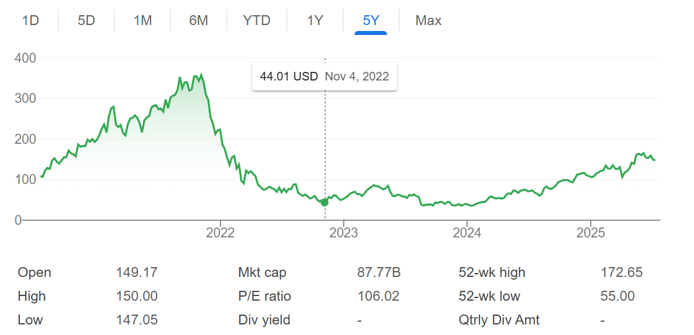

我终于还是下定决心从 Garena 离职了。主要还是希望结束异地，对象在广州的工作也挺稳定的了，想了想最重要的还是和爱人在一起，不能再拖时间了，所以下定决心，冲去广州！

## 旧的旅程

说实话能加入 Garena 也是挺神奇的一件事情，毕竟公司名气不大，当时具体的原因我应该在[这期播客](https://www.xiaoyuzhoufm.com/episode/628a54c15cf4a5ad60ca094d)聊过。二老师当时说他朋友在这边，不咋加班，然后面了下体验不错，给的包也很大，所以我也没想那么多就接了。现在回头看，我还是应该根据 mwish 的建议，应该多找同组内鬼和游戏业界的前辈多聊聊，实际的入职体验确实和我想象的不一样。

### 入职回忆

我记得刚入职的我体验特别好，leader 不 push，给了我们新人充分的时间来学习 Unity 和 C#。我也是火力全开，一开始给我的 jira 单子几乎都是工具类的，基本上半天就做完了，然后我还去 push 我 leader 给我新的单子，感受到了自己火一样的热情。按时下班，leader 很好，假很多，氛围很好。

但是慢慢地感觉到有点不对，入职前没了解 FF 的目标市场以及自己未来要干什么，我觉得与自己的预期有所差距。我预期中大概是做渲染，或者是做引擎底层的框架开发，实际上差别还挺大的。当时我特别不理解的事情是，为什么我在引擎组，但是没有引擎的源码权限。因为不接触源码，所以做的事情也都很外围，说实话我几乎都不记得我第一年干了啥了，都是很 trivial 的东西，大概有一些客户端的 GC 优化、支持一些 UGC 的功能等等。

另外，因为 target 在低端机市场，开发和测试体验真的太差了，装个 apk 包动不动 1 分钟，进游戏半分钟，也可以说是磨练心性的好机会吧。当然刚入职也很奇怪，感觉技术氛围相对淡薄，大家怎么都不讨论技术的。我当时理想中的开发 team 应该是活跃讨论技术的，现在看我还是太年轻了。慢慢理解了对很多人而言，其实工作也就是一份工作罢了，下班打游戏多好，研究这些也没啥用。就我个人面试体验而言，业余搞的开源啥的固然也加分，但因为我也没做到顶尖，所以确实给面试加分也是有限吧。

### 裁员风波

然后就是紧接着的大裁员，具体的还能搜到当时很多新闻，校招的很多朋友们都被裁了，唉。公司氛围人心惶惶的，我也很害怕。leader 人很好，牺牲了其他人保下了我们校招生，我确实很感激他。

我当时因为裁员的影响，加上上文提到的觉得自己干的活儿很奇怪，还去又面了叠纸的引擎开发。叠纸那位 HR 人真的还挺好的，有一个 HC 说可以给我留着，聊完应该是过了的，只是当时因为害怕搬家的麻烦、害怕要退签字费等等现在回看很神奇的理由，我还是选择留在 Garena 了。有时候我还是会想如果当时去了，未来发展会咋样，也许会因为是做 UE 所以发展更好吧，但叠纸这个公司看我朋友们的评价也是一言难尽，也不好说。现在的新 offer 就是做 UE，也许其实这也是一种变相还债吧。

我记得就是从那阵子开始静息心率飙升到 60+，自此再也没怎么下去过了，当然这可能主要是怪上班，和裁员没关系。回头想想我还是很感激这次裁员，寒气逼人，让我降低期望，所以我确实就是不会做出飘飘欲仙然后买个豪车/上海买房之类的事情，这种不安全感一直抓着我。

### 股价故事

股价是个有趣的话题，如图，裁员那阵以及接下来的一年确实就是一直下跌，财报出一次就大跌一次，股价过山车，直到 2024 年开始才稍微稳定一些，开始往上走。

公司也是很有趣，新闻上看到 2022 年很多同事的年终被强制换了股票，我当时以为是恶心人的决策，现在回头看，确实很有一手。从公司角度而言，如果觉得自己被低估，那肯定要买入自家股票，不然怎么给外部传达出自己的信心。然后另一方面，如果你觉得恶心要走，那就走吧，啥也带不走，虾皮甚至开了主动 N+1 的通道；如果选择留下，那好好干，股价上涨的话收益也特别高，毕竟现在最高到过 172，毕竟是比 2023 年初的 3-4 倍了。

对我而言，我因为卖早了“亏损”很多很多。当时被整个失败主义的氛围影响，根本没有心思等待股票从低谷走出来，vest 一笔我就卖掉一笔，落袋为安。当时觉得自己的工作都朝不保夕，现在回头看自己还是根本没想清楚，工作朝不保夕和卖股票其实一点关系都没有，自己太过意气用事，这也是应了那句话：“赚不到认知以外的钱”。另一方面，也是我的过往经历使然，我自己本身对于金钱的安全感就十分闲有限，做出那样的决定也不奇怪。可惜，也没啥补救的办法了，因为我就要走了也没啥股票了，但是认知因为这件事情升级了！

有个前同事还搞了个股价 bot，虽然他自己跑路了，但是 bot 代码继承给了另一个同事维护，而我就把股价每天转发给朋友们，散播焦虑！

### 体验好转

我的工作体验好转来自于开始升级 FF 的 Unity 引擎版本，这个活儿很大，面很广，非常具有挑战性，具体的细节之前[聊过](https://jsjtxietian.github.io/2025/03/25/upgrade_to_unity2022/)。对我来说有趣的有几点：一是脱离了具体的业务开发，可以不用天天做我认为稍微有点 trivial 的工作了；二是有机会从整体上思考 FF 之前引擎做过哪些优化，是怎么做的，能不能在新的引擎版本上也实现一下；三是当救火队长，新的引擎版本出的各种问题都是我来看，也算是有些理解了 Unity 引擎的某些方面的设计；四是在对比版本性能的时候，也培养了一些对于性能的直觉。那段时间的工作体验确实非常好，当然后期也会很累，bug 多起来的时候确实来不及看，性能差的时候也不知道是为啥，但好歹挺过来了。

在开始升级 FF 的差不多同一时间，mwish 带着我写了两个 arrow 的 pr，很简单，但是给了我一点信心。后面因为我的工作和 arrow 没关系，有点写不下去，就换了赛道，去写 godot 了，然后一发不可收拾。2023.9 到 2024.9 年中间业余时间搞了一年的 godot，虽然写的 commit 都很简单，修修 editor 的 bug，看看 shader 的问题等等，但是正反馈很足，我也是乐在其中。白天写 Unity，晚上搞 godot，引擎之神就是我。后面甚至在公司给 godot 布道，也算是有个圆满的结局。当时觉得给 godot 写代码比自己造轮子还是好些的，毕竟是真的帮到了别人，而且有那么多免费用户帮忙测试；现在则因为觉得 ROI 稍微有点低暂时不搞了，去刻意练习一些自己不会的东西更有用一些。

另外也开始看一些 CPU 性能方向的东西，也算是根据项目的需求和自己的兴趣找到了一个比较平衡的方向，不像刚工作那阵像是没头苍蝇一样到处看资料，方法也不对，也没啥积累，几乎都忘光了哈哈。后面陆陆续续看了看 Rust，Cuda，Vulkan 啥的，也都算和这个方向有那么一点点关系，至少更脚踏实地了。另外因为压力不大，每天空闲时候我都会刷刷知乎、X 看看关注的人发了啥技术文章，也算是开开眼界。

### 一点反思

虽然工作总是越来越忙的，但我还是很感谢 Garena 整体上的 WLB（三年来我只有一次周末来公司加班），它给了我很多的时间，可以用来阅读、学习、玩游戏等等，真的是很舒服的一个状态。而且即使很忙，整体的压力值也不会很大。有时候觉得在这里，pay 不错 + 压力小 + 年假病假多这几个叠加起来，真的没啥可抱怨的，尤其是对比新的 offer，年假病假断崖式下跌，放眼望去很难有这些方面比 Garena 更好的公司了。在前文提到的好转阶段之后，我确实工作也挺开心的，可以折腾自己喜欢折腾的东西，正儿八经去搞看似高端的引擎开发。

经过这三年工作，虽然我还是很菜，基础不够扎实，经验也不够丰富，但是好歹获得或者说保持了一些还不错的东西：人还算健康，也有在坚持健身，静息心率能保持 60 左右；技术视野确实比三年前更广阔了，接触了 Unity 和 Godot 源码，也算是对游戏引擎有一些初步的理解了；攒了一点钱，虽然不多，但是日常上不会很拮据，抗风险能力大大提升；和很多优秀的同事成为朋友，谢谢他们让我生活快乐了很多。

虽然本节不是按 The Good, the bad and the ugly 排序的，但我结合这次面试的体验，确实对一些在 FF 项目组体验到的东西有一些反思。FF 虽然确实在性能方便做了很多工作，但是确实我从对我的职业发展而言，认为还是有几个我觉得不合我口味的地方，一是因为市场所以优化方向上主要是包体、内存之类，不是说这俩不重要，而是为了这俩确实牺牲了很多；二是对工具的重视程度太低，导致大量的时间被浪费在低效的事情上，比如我们的 profiler 工具经常导致卡死，对性能拖累贼大，我是觉得基本不能用的，也不好好处理下（这也是我去搞 simpleperf 的原因之一）；三是因为一些原因（[这里](https://jsjtxietian.github.io/2025/04/01/learning_in_ff/)提过一些，主要是风险厌恶），其实深度优化做的很少，我个人还是认为没有架构上的改动则不可能有真正意义上的巨大收益的优化。如果说 CPU 上的优化只是做的不够深度，GPU 上的优化则是几乎没做啥，全靠砍美术资产这种风险低的方案，但是我觉得有些不体面。当然这也有一部分是因为为了照顾最低端机器用户的体验，target 的 gles 版本太低了，连 compute shader 支持都没有，想做也没法做啥。

这就导致我出去面试被问到这方面，gpu clock 会看吗，怎么优化，我实在是没法回答什么，因为确实也没接触过。这也是我为啥想走的原因之一，我虽然对 FF 这个实践本身没啥意见，但我希望我自己做的东西和积累的经验还是不要脱离国内的潮流太久，只能说还好自己的可适应性很强吧，还能勉强摸爬滚打一下。另外也有很令人迷惑的地方，那就是对全体研发人员有强制的 FF 段位要求，和绩效挂钩，我只能说我不是很喜欢这种强制要求。

如上所述，虽然 FF 有一些做事的方法我是不认同的，但是我很尊重现在的这套流程，也理解这种做法自有它的理由。就比如为了最低端的那些机器能跑其实要稍微牺牲点大多数其他机器的体验这个事情来说，我理解它本身是个复杂的问题，利益相关方特别多，不能只从技术的角度看。我只想说我们可能可以做到更好，但确实技术上或非技术上都限制重重，负重前行。

说到最后，还是感觉这里的经历真的很有趣，可能是以后都体验不到的，所以我很珍惜这里的时光。FF 作为一个产品，那么成功就必然有值得学习的地方，我尊重 FF 走的路，只是我想走的路确实不太一样，那就优雅地说再见吧。

## 新的历险

我面试整体比较随意，简历也是随便写的。之前先投了 Unity 广州的一个用 ECS 写粒子系统的岗位，HR 那边就给我挂了，离谱。然后请之前在腾讯实习时候认识的大哥给推了鸣潮，一面线上，二面线下，纯就面试体验而言还不错。二面面试官人挺好的，直接给反馈觉得我经验少，那也确实（这种直接反馈我很喜欢），然后问了问美术资产性能相关的，纹素密度、三角形密度啥的开放题，我也没咋回答好。面试官也挺实在的，说我这个简历，也不会去 4399、多益啥的，所以可能选择也不多，哈哈确实。面完就拔牙去了，痛了一周，所以没继续投其他的。然后还是发 offer 了，进入谈薪阶段，薪资确实有点震撼到我，狠狠砍了我一刀。

我纠结了好久，也和朋友们都聊了聊，本来已经下定决心接了，小伙说可以帮我推下永星，我也试了试。然后迅速面完，体验也不错（俩面试官都说我简历上没写啥东西，我是真的不会写简历啊）。谈薪阶段虽然也是砍我一刀，但是有了鸣潮那么低的预期，我反而非常乐于接受了，base 至少保住了，其他年终、股票啥的也无所谓了，没了就没了吧，结束异地重要。鸣潮虽然项目不错，面试体验也还可以，但是有些新闻确实也够吓人，另外有朋友劝退我，以后还有缘分的话，变强了再去聊吧。

新工作是做 UE 的引擎开发，说实话我也挺感激小伙帮我内推、永星愿意给我这个机会的。我个人理解这是一种补完，我做了 3 年 FF，一个面向东南亚低端机市场的、PVP 射击的大逃杀游戏，现在能去做一些高端些的、重视品质的二次元游戏，真好。从 Unity 转到 UE，也是我所中意的，我的想法是，总是要去盘子越来越大的地方，UE 确实比 Unity 在各种意义上都好一些，赶紧跳车吧。虽然现在 AI 大行其道，但是只能慢慢往上靠了。很期待新的工作体验，虽然我现在是没啥时间提前学习 UE 了，现在约各种朋友，忙炸了。

回头看这三年，很开心，没啥可后悔的。经历都是财富，没有失败，只有反馈。不管如何，该下一站了，感谢一路陪伴的朋友们，开开心心迎接新的生活吧。

