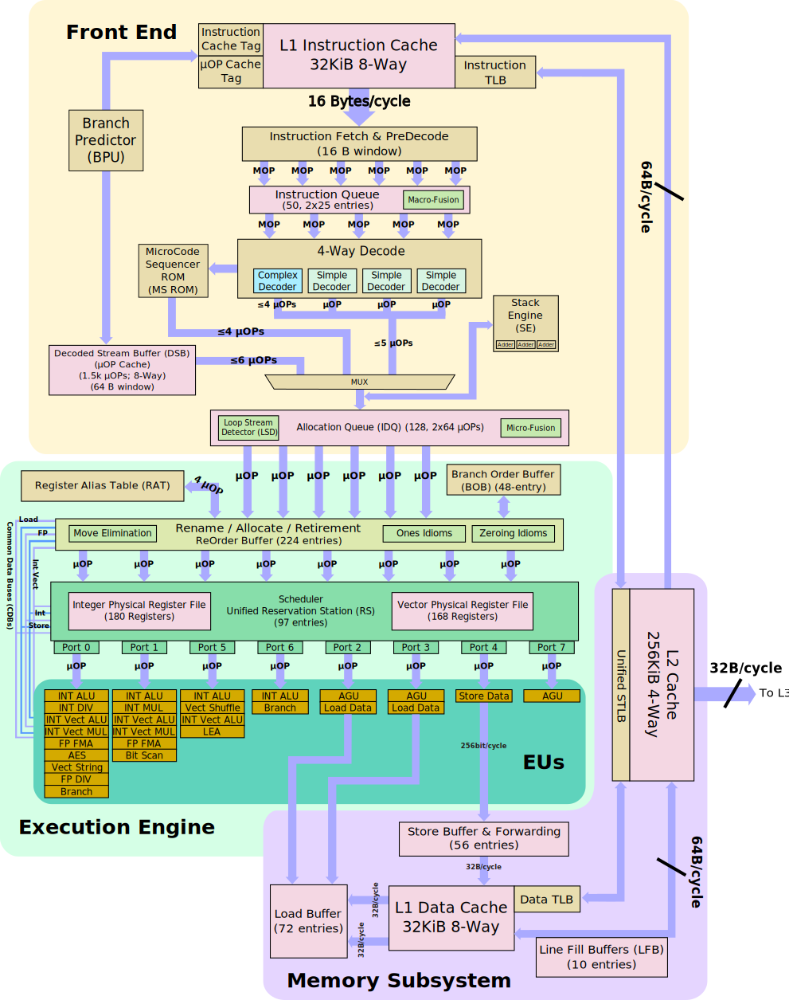

### CPU Microarchitecture

图来自[^2]



The CPU **Front-End** consists of a number of data structures that serve the main goal to efficiently fetch and decode instructions from memory. Its main purpose is to feed prepared instructions to the CPU Back-End, which is responsible for the actual execution of instructions.

The CPU **Back-End** employs an Out-Of-Order engine that executes instructions and stores results. The heart of the CPU backend is the 224 entry ReOrder buffer (ROB). This unit handles data dependencies. The ROB maps the architecture-visible registers to the physical registers used in the scheduler/reservation station unit. ROB also provides register renaming and tracks speculative execution. ROB entries are always retired in program order.

The Reservation Station/Scheduler (RS) is the structure that tracks the availability of all resources for a given UOP and dispatches the UOP to the assigned port once it is ready. The core is 8-way superscalar. Thus the RS can dispatch up to 8 UOPs per cycle. 


#### PMU

硬件基础

Most modern PMUs have a set of Performance Monitoring Counters (PMC) that can be used to collect various performance events that happen during the execution of a program.


### TMAM方法论

The concept behind TMA’s top-level breakdown[^3]：

If uop for instruction was not allocated during a particular cycle of execution, it could be for two reasons: we were not able to fetch and decode it (Front End Bound), or Back End was overloaded with work and resources for new uop could not be allocated (Back End Bound). Uop that was allocated and scheduled for execution but not retired is related to the Bad Speculation bucket.


The TMA hierarchy of performance bottlenecks[^3]：


We run the workload several times, each time focusing on specific metrics and drilling down until we get to the more detailed classification of performance bottleneck. 

Analysis tools such as Intel VTune Profiler, AMD uprof, and Linux perf can calculate all the metrics with a single run of the benchmark.


### 换一个视角

主要资料来自[^1]。

#### Predictability of Code

How well a CPU can predict the control flow of a program (Branch prediction).

* Ideal: Every branch outcome is predicted correctly in 100% of the cases.
* Worst: random control flow patterns.

#### Predictability of Data

How well a CPU can hide the latency of memory accesses by prefetching the data ahead of time.

* Ideal: Every memory access is served from a closest cache. 
* Worst: random memory access patterns with large strides.

#### Execution Throughput

 How well instructions progress through the CPU pipeline. This includes fetching, discovering independent instructions (aka “extracting parallelism”), and issuing and executing instructions in parallel. The width of a CPU pipeline characterizes how many independent instructions it can execute per cycle.

* Ideal: No stalls in the execution pipeline, 100% of the CPU bandwidth is utilized. 
* Worst: Instructions compete for a particular execution resource.

#### Execution Latency（Data Dependency Chains）

How well a CPU can process a long sequence of instructions, where each of them depends on a previous one.

* Ideal: massively parallel application few/short dependencies.
* Worst: a long sequence of dependent instructions,e.g. pointer chaising. 


### Memory Bound 


#### loop interchange: 88%

```c++
void multiply(Matrix &result, const Matrix &a, const Matrix &b) {
  zero(result);
#ifdef SOLUTION
  for (int i = 0; i < N; i++) {
    for (int k = 0; k < N; k++) {
      for (int j = 0; j < N; j++) {
        result[i][j] += a[i][k] * b[k][j];
      }
    }
  }
#else
  for (int i = 0; i < N; i++) {
    for (int j = 0; j < N; j++) {
      for (int k = 0; k < N; k++) {
        result[i][j] += a[i][k] * b[k][j];
      }
    }
  }
#endif
}
```


#### huge page 56%


### Core Bound

#### compiler intrinsics 75%

```c++
#ifdef SOLUTION
  // loop processes 8 elements per iteration
  for (; i + 7 < limit - pos; i += 8) {
    // 1. Calculate vector diff: input[i+radius] - input[i-radius-1]
    __m128i sub_u8 = _mm_loadu_si64(subtractPtr + i);
    __m128i sub = _mm_cvtepu8_epi16(sub_u8);
    __m128i add_u8 = _mm_loadu_si64(addPtr + i);
    __m128i add = _mm_cvtepu8_epi16(add_u8);

    __m128i diff = _mm_sub_epi16(add, sub);

    // 2. Calculate vector prefix sum for 8 elements
    __m128i s = _mm_add_epi16(diff, _mm_slli_si128(diff, 2));
    s = _mm_add_epi16(s, _mm_slli_si128(s, 4));
    s = _mm_add_epi16(s, _mm_slli_si128(s, 8));

    // 3. Store the result
    __m128i result = _mm_add_epi16(s, current);
    _mm_storeu_si128((__m128i*)(outputPtr + i), result);

    // 4. Broadcast currentSum for the next iteration
    currentSum = (uint16_t)_mm_extract_epi16(result, 7);
    current = _mm_set1_epi16(currentSum);
  }
  ...

  // Still keep the sequential loop to process the remainder.
  for (; pos < limit; ++pos) {
    currentSum -= input[pos - radius - 1];
    currentSum += input[pos + radius];
    output[pos] = currentSum;
  }
#else
  for (; pos < limit; ++pos) {
    currentSum -= input[pos - radius - 1];
    currentSum += input[pos + radius];
    output[pos] = currentSum;
  }
#endif
```


#### inline 47%

```c++
static int compare(const void *lhs, const void *rhs) {
  auto &a = *reinterpret_cast<const S *>(lhs);
  auto &b = *reinterpret_cast<const S *>(rhs);

  if (a.key1 < b.key1)
    return -1;

  if (a.key1 > b.key1)
    return 1;

  if (a.key2 < b.key2)
    return -1;

  if (a.key2 > b.key2)
    return 1;

  return 0;
}

void solution(std::array<S, N> &arr) {
#if SOLUTION
  std::sort(arr.begin(),arr.end(),[](S& a, S& b)
  {
    return a.key1 < b.key1 || (a.key1 == b.key1) && (a.key2 < b.key2); 
  });
#else
  qsort(arr.data(), arr.size(), sizeof(S), compare);
#endif
```


#### dep_chain 10%

```c++
template <class RNG>
void randomParticleMotion(std::vector<Particle> &particles, uint32_t seed) {
#if SOLUTION
  RNG rng1(seed);
  RNG rng2(seed);
  for (int i = 0; i < STEPS; i++) {
    for (int j = 0; j + 1 < particles.size(); j += 2) {
      uint32_t angle1 = rng1.gen();
      float angle_rad1 = angle1 * DEGREE_TO_RADIAN;
      particles[j].x += cosine(angle_rad1) * particles[j].velocity;
      particles[j].y += sine(angle_rad1)   * particles[j].velocity;
      uint32_t angle2 = rng2.gen();
      float angle_rad2 = angle2 * DEGREE_TO_RADIAN;
      particles[j+1].x += cosine(angle_rad2) * particles[j+1].velocity;
      particles[j+1].y += sine(angle_rad2)   * particles[j+1].velocity;
    }
  }
#else
  RNG rng(seed);
  for (int i = 0; i < STEPS; i++)
    for (auto &p : particles) {
      uint32_t angle = rng.gen();
      float angle_rad = angle * DEGREE_TO_RADIAN;
      p.x += cosine(angle_rad) * p.velocity;
      p.y += sine(angle_rad) * p.velocity;
    }
#endif
}
```


### Bad Speculation

#### vtable => -0.80 , 0.98 if get rid of all virtual and use pod

```c++
void generateObjects(InstanceArray& array) {
    std::default_random_engine generator(0);
    std::uniform_int_distribution<std::uint32_t> distribution(0, 2);

    InstanceArray arrayA;
    InstanceArray arrayB;
    InstanceArray arrayC;
    for (std::size_t i = 0; i < N; i++) {
        int value = distribution(generator);
        if (value == 0) {
            arrayA.push_back(std::make_unique<ClassA>());
        } else if (value == 1) {
            arrayB.push_back(std::make_unique<ClassB>());
        } else {
            arrayC.push_back(std::make_unique<ClassC>());
        }
    }

    array.insert( array.end(), std::make_move_iterator(arrayA.begin()), std::make_move_iterator(arrayA.end()) );
    array.insert( array.end(), std::make_move_iterator(arrayB.begin()), std::make_move_iterator(arrayB.end()) );
    array.insert( array.end(), std::make_move_iterator(arrayC.begin()), std::make_move_iterator(arrayC.end()) );
}

#else
void generateObjects(InstanceArray& array) {
    std::default_random_engine generator(0);
    std::uniform_int_distribution<std::uint32_t> distribution(0, 2);

    for (std::size_t i = 0; i < N; i++) {
        int value = distribution(generator);
        if (value == 0) {
            array.push_back(std::make_unique<ClassA>());
        } else if (value == 1) {
            array.push_back(std::make_unique<ClassB>());
        } else {
            array.push_back(std::make_unique<ClassC>());
        }
    }
}
#endif
```


#### lookup table => 0.88

```c++
#ifdef SOLUTION
const static int buckets[101] = {
    0, 0, 0, 0, 0, 0, 0, 0, 0, 0, 0, 0, 0, // thirteen 0s
    1, 1, 1, 1, 1, 1, 1, 1, 1, 1, 1, 1, 1, 1, 1, 1, // sixteen 1s
    2, 2, 2, 2, 2, 2, 2, 2, 2, 2, 2, 2, // twelve 2s
    3, 3, 3, 3, 3, 3, 3, 3, 3, 3, 3, 3, // twelve 3s
    4, 4, 4, 4, 4, 4, 4, 4, 4, 4, 4, 4, 4, 4, 4, 4, 4, 4, // eighteen 4s
    5, 5, 5, 5, 5, 5, 5, 5, 5, 5, 5, 5, // twelve 5s
    6, 6, 6, 6, 6, 6, 6, 6, 6, 6, 6, 6, 6, 6, 6, 6, 6, // seventeen 6s
    DEFAULT_BUCKET
};
static std::size_t mapToBucket(std::size_t v) {
  constexpr auto Nelements = sizeof (buckets) / sizeof (int);
  return buckets[std::min(v, Nelements - 1)];
}

#else

static std::size_t mapToBucket(std::size_t v) {
                              //   size of a bucket
  if      (v < 13)  return 0; //   13
  else if (v < 29)  return 1; //   16
  else if (v < 41)  return 2; //   12
  else if (v < 53)  return 3; //   12
  else if (v < 71)  return 4; //   18
  else if (v < 83)  return 5; //   12
  else if (v < 100) return 6; //   17
  return DEFAULT_BUCKET;
}

#endif
```


#### branches_to_cmov_1 

cmove:49%

branchless:-0.93

```c++
#if SOLUTION
                int cell = current[i][j];
                if (__builtin_unpredictable(aliveNeighbours != 2))
                    cell = 0;
                if (__builtin_unpredictable(aliveNeighbours == 3))
                    cell = 1;
                future[i][j] = cell;
#else
                switch(aliveNeighbours) {
                    // 1. Cell is lonely and dies
                    case 0:
                    case 1:
                        future[i][j] = 0;
                        break;                   
                    // 2. Remains the same
                    case 2:
                        future[i][j] = current[i][j];
                        break;
                    // 3. A new cell is born
                    case 3:
                        future[i][j] = 1;
                        break;
                    // 4. Cell dies due to over population
                    default:
                        future[i][j] = 0;
                }
#endif
```


### Frontend Bound

FE没法即使把指令送去BE，所以Back-End在空等Front-End送来指令。

caches utilization and inability to fetch instructions from memory


### Other

##### IO

mmap

direct io，overlapped io

io_ring


##### C++

LTO，PGO


### 总结

欢迎提issue交流：[Issues · jsjtxietian/jsjtxietian.github.io](https://github.com/jsjtxietian/jsjtxietian.github.io/issues)


[^1]: [Four Cornerstones of CPU Performance. | Easyperf](https://easyperf.net/blog/2022/10/17/Four-Cornerstones-of-CPU-Performance)
[^2]:[Kaby Lake - Microarchitectures - Intel - WikiChip](https://en.wikichip.org/wiki/intel/microarchitectures/kaby_lake)

[^3]: Ahmad Yasin. A top-down method for performance analysis and counters architecture. pages 35–44, 03 2014. ISBN 978-1-4799-3606-9. doi: 10.1109/ISPASS.2014.6844459.
