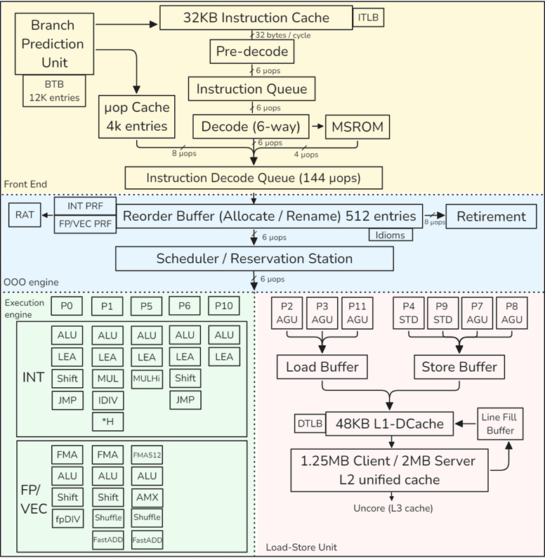
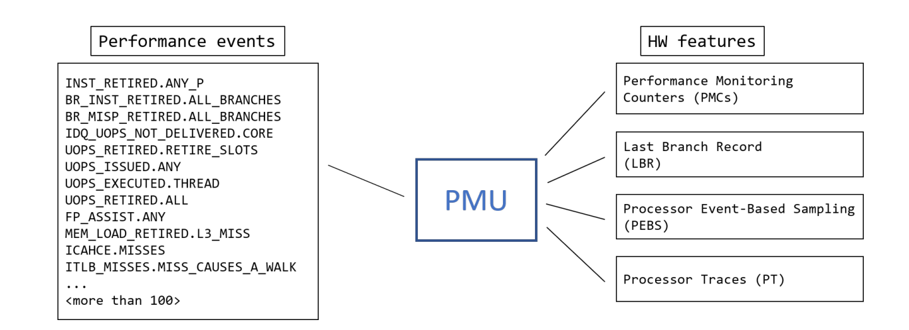
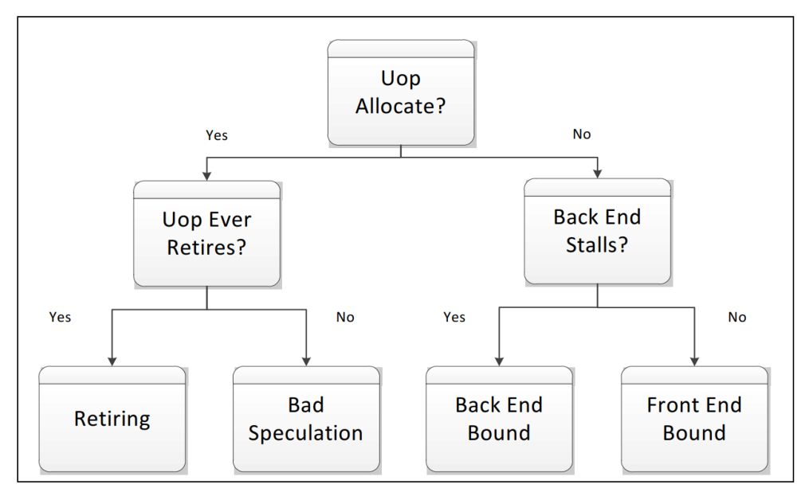
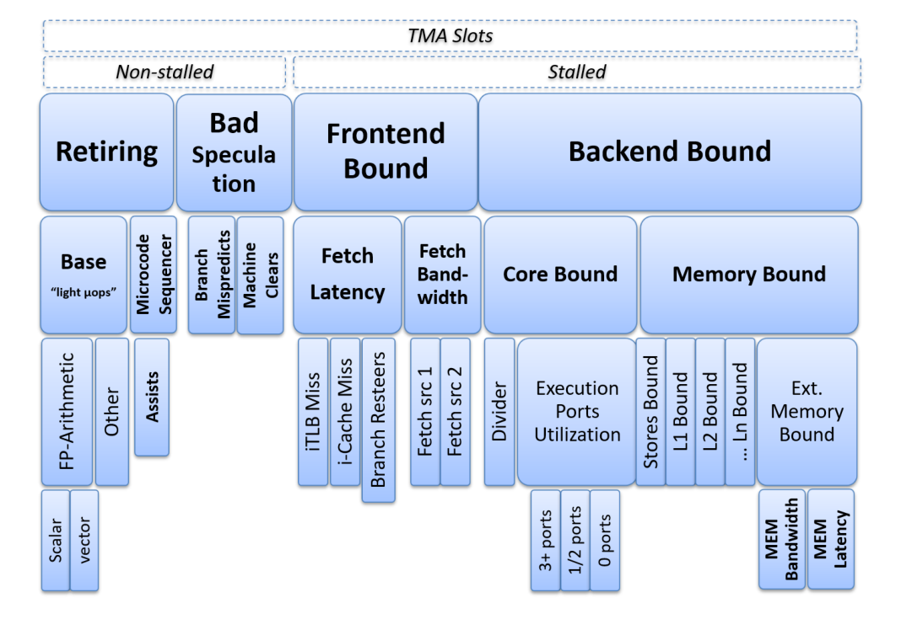
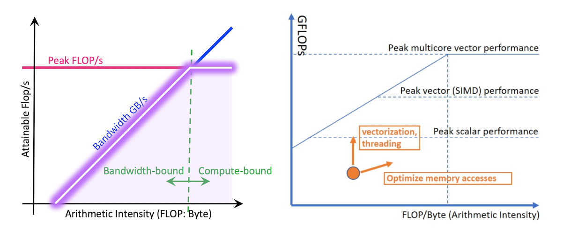
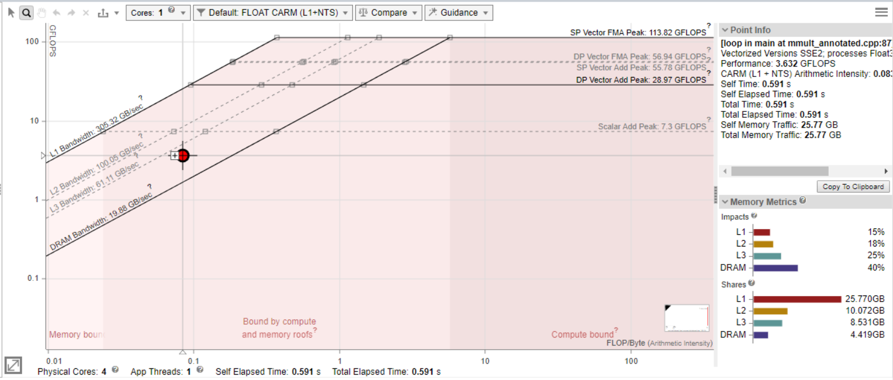
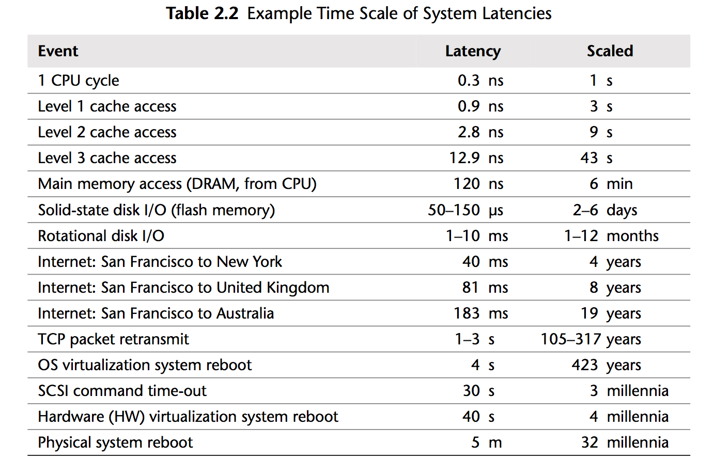

## CPU Microarchitecture

 The implementation of Intel 12th-generation core, Golden Cove

### CPU Front-End

Its main purpose is to feed prepared instructions to the CPU Back-End, which is responsible for the actual execution of instructions.

Once a program reaches a steady state, the branch predictor unit (**BPU**) steers the work of the CPU Frontend. The BPU predicts the target of all branch instructions and steers the next instruction fetch based on this prediction.

The Instruction Decode Queue (**IDQ**) provides the interface between the in-order frontend and the out-of-order backend.

### CPU Backend

The CPU **Back-End** employs an Out-Of-Order engine that executes instructions and stores results. 

The heart of the OOO engine is the 512-entry ReOrder Buffer (**ROB**): register renaming, allocates execution resources, tracks speculative execution.

The “Scheduler / Reservation Station” (**RS**) is the structure that tracks the availability of all resources for a given µop and dispatches the µop to an execution port once it is ready.

The FP/VEC stack does floating-point scalar and all packed (SIMD) operations. Operations that move values from the INT stack to FP/VEC and vice-versa (e.g., convert, extract, or insert) incur additional penalties.

### Load-Store Unit

The Load-Store Unit (LSU) is responsible for operations with memory. 

**AGU** stands for Address Generation Unit, which is required to access a memory location. **AGU** is required for both load and store operations to perform dynamic address calculation. 

Once a load or a store leaves the scheduler, the LSU is responsible for accessing the data. Load operations save the fetched value in a register. Store operations transfer value from a register to a location in memory. LSU has a **Load Buffer** (also known as Load Queue) and a **Store Buffer** (also known as Store Queue).

When a memory load request comes, the LSU queries the L1 cache using a virtual address and looks up the physical address translation in the TLB. Those two operations are initiated simultaneously. In case of an L1 miss, the hardware initiates a query of the (private) L2 cache tags. While the L2 cache is being queried, a 64-byte wide **fill buffer (FB)** entry is allocated, which will keep the cache line once it arrives. As a way to lower the latency, a speculative query is **sent to the L3 cache in parallel** with the L2 cache lookup. Also, if two loads access the same cache line, they will hit the same FB. Such two loads will **be “glued” together** and only one memory request will be initiated.

**Streaming stores**: the processor will try to combine writes to fill an entire cache line. All these optimizations are done inside the Store Buffer. The LSU supports store-to-load forwarding when there is an older store containing all of the load’s bytes, and the store’s data has been produced and is available in the store queue.

Non-temporal memory accesses are special CPU instructions that do not keep the fetched line in the cache and drop it immediately after use.

In most high-performance processors, the order of load and store operations is not necessarily required to be the same as the program order, which is known as a **weakly ordered memory model**.

### TLB Hierarchy

In case a translation was not found in the TLB hierarchy, it has to be retrieved from the DRAM by “walking” the kernel page tables. The key element to speed up the page walk procedure is a set of Paging-Structure Caches that cache the hot entries in the page table structure. 

The Golden Cove microarchitecture has four dedicated page walkers, which allows it to process 4 page walks simultaneously. In the event of a TLB miss, these hardware units will issue the required loads into the memory subsystem and populate the TLB hierarchy with new entries.

### PMU

性能监控的硬件基础：Most modern PMUs have a set of Performance Monitoring Counters (PMC) that can be used to collect various performance events that happen during the execution of a program.

## 方法

### TMAM

[Top-down Microarchitecture Analysis Method](https://www.intel.com/content/www/us/en/docs/vtune-profiler/cookbook/2023-0/top-down-microarchitecture-analysis-method.html) for identifying CPU bottlenecks in a program.

Pipeline slot:

> The Front-end of the pipeline on recent Intel microarchitectures can allocate four uOps per cycle, while the Back-end can retire four uOps per cycle. From these capabilities **the abstract concept of a pipeline slot** can be derived. A pipeline slot represents the hardware resources needed to process one uOp. The Top-Down Characterization assumes that for each CPU core, on each clock cycle, there are four pipeline slots available. It then uses specially designed PMU events to measure how well those pipeline slots were utilized. The status of the pipeline slots is taken at the allocation point , where uOps leave the Front-end for the Back-end. Each pipeline slot available during an application’s runtime will be classified into one of four categories based on the simplified pipeline view described above. 

At a conceptual level, TMA identifies **what is stalling the execution** of a program[^1].

There are internal buffers in the CPU that keep track of information about µops that are being executed. If uop for instruction was not allocated during a particular cycle of execution, it could be for two reasons: we were not able to fetch and decode it (Front End Bound), or Back End was overloaded with work and resources for new uop could not be allocated (Back End Bound). Uop that was allocated and scheduled for execution but not retired is related to the Bad Speculation bucket. If a µop was allocated and scheduled for execution but never retired, this means it came from a mispredicted path (Bad Speculation).

TMA observes the execution of a program by monitoring a specific set of performance events and then calculates metrics based on predefined formulas. The TMA hierarchy of performance bottlenecks:

We run the workload several times, each time focusing on specific metrics and drilling down until we get to the more detailed classification of performance bottleneck. 

Analysis tools such as Intel VTune Profiler, AMD uprof, and Linux perf can calculate all the metrics with a single run of the benchmark.

### Roofline

Throughput-oriented performance model: The “roofline” in this model expresses the fact that the performance of an application cannot exceed the machine’s capabilities. Every function and every loop in a program is limited by either compute or memory capacity of a machine.

图来自：[Identify Performance Bottlenecks Using CPU Roofline](https://www.intel.com/content/www/us/en/docs/advisor/get-started-guide/2023-1/identify-bottlenecks-using-cpu-roofline.html#GUID-7CEF87D7-E2C1-4BA8-9D50-9647785B063D)

The Roofline Performance Model can be helpful to:
* Identify performance bottlenecks.
* Guide software optimizations.
* Determine when we’re done optimizing.
* Assess performance relative to machine capabilities.

The Roofline performance model is mainly applicable for HPC applications that have few compute-intensive loops. Do not recommend using it for general-purpose applications, such as compilers, web browsers, or databases.

Top-Down microarchitecture analysis and Roofline performance analysis should usually be a good way to start. Most of the time you’ll see a mix of problems, so you have to analyze hotspots case by case. 

### Mental Model: Four Cornerstones of CPU Performance

主要资料来自：[Four Cornerstones of CPU Performance. | Easyperf](https://easyperf.net/blog/2022/10/17/Four-Cornerstones-of-CPU-Performance)

#### Predictability of Code

How well a CPU can predict the control flow of a program (Branch prediction).
* Ideal: Every branch outcome is predicted correctly in 100% of the cases.
* Worst: random control flow patterns.

#### Predictability of Data

How well a CPU can hide the latency of memory accesses by prefetching the data ahead of time.
* Ideal: Every memory access is served from a closest cache. 
* Worst: random memory access patterns with large strides.

#### Execution Throughput

How well instructions progress through the CPU pipeline. This includes fetching, discovering independent instructions (aka “extracting parallelism”), and issuing and executing instructions in parallel.
* Ideal: No stalls in the execution pipeline, 100% of the CPU bandwidth is utilized. 
* Worst: Instructions compete for a particular execution resource.

#### Execution Latency (Data Dependency Chains)

How well a CPU can process a long sequence of instructions, where each of them depends on a previous one.
* Ideal: massively parallel application few/short dependencies.
* Worst: a long sequence of dependent instructions,e.g. pointer chaising. 

## Case

一些简单的优化实例，持续收集。

### Memory Bound 

* Cache-Friendly Data Structures
  * folly 的哈希表 [CppCon 2017: Matt Kulukundis “Designing a Fast, Efficient, Cache-friendly Hash Table, Step by Step”](https://www.youtube.com/watch?v=ncHmEUmJZf4)
* Access data sequentially
  * [loop_interchange_1 at master](https://github.com/jsjtxietian/perf-ninja-solution/tree/master/labs/memory_bound/loop_interchange_1)
  * [loop_interchange_2 at master](https://github.com/jsjtxietian/perf-ninja-solution/tree/master/labs/memory_bound/loop_interchange_2)
* Packing the data
  * [data_packing at master](https://github.com/jsjtxietian/perf-ninja-solution/tree/master/labs/memory_bound/data_packing)
* Aligning and padding
  * [mem_alignment_1 at master](https://github.com/jsjtxietian/perf-ninja-solution/tree/master/labs/memory_bound/mem_alignment_1)
  * [misaligned-access](https://github.com/Kobzol/hardware-effects/tree/master/misaligned-access)
  * Structure splitting、Pointer inlining 等技巧
* Tune the code for memory hierarchy: loop blocking (tiling), cache-oblivious algorithms...
  * [loop_tiling_1 at master](https://github.com/jsjtxietian/perf-ninja-solution/tree/master/labs/memory_bound/loop_tiling_1)
  * [Cache-Oblivious Algorithms - Algorithmica](https://en.algorithmica.org/hpc/external-memory/oblivious/)
* Explicit Memory Prefetching: `__builtin_prefetch`
  * [swmem_prefetch_1 at master](https://github.com/jsjtxietian/perf-ninja-solution/tree/master/labs/memory_bound/swmem_prefetch_1)
  * [prefetching](https://github.com/Kobzol/hardware-effects/tree/master/prefetching)
* Optimizing For DTLB: Huge page
  * [huge_pages_1 at master](https://github.com/jsjtxietian/perf-ninja-solution/tree/master/labs/memory_bound/huge_pages_1)
  * [Performance Challenge #6 - Google 幻灯片](https://docs.google.com/presentation/d/16M90It8nOK-Oiy7j9Kw27o9boLFwr6GFy55XFVzaAVA/edit#slide=id.gf46e3bea08_0_131)
  * 除了数据以外，代码也可以：[Performance Benefits of Using Huge Pages for Code. | Easyperf](https://easyperf.net/blog/2022/09/01/Utilizing-Huge-Pages-For-Code)
* Memory order violation
  * [mem_order_violation_1 at master](https://github.com/jsjtxietian/perf-ninja-solution/tree/master/labs/memory_bound/mem_order_violation_1)
* Dynamic memory allocation: jemalloc, arena...
  * 无脑换 mimalloc
  * C++ PMR
* 注意一些 hardware effects
  * Store-to-load forwarding 的[4k-aliasing](https://github.com/Kobzol/hardware-effects/tree/master/4k-aliasing)
  * 8-way associative cache 的[cache-conflicts](https://github.com/Kobzol/hardware-effects/tree/master/cache-conflicts)
  * 内存刷新 [dram-refresh](https://github.com/Kobzol/hardware-effects/tree/master/dram-refresh)
  * write combining：[write-combining](https://github.com/Kobzol/hardware-effects/tree/master/write-combining)

牢记 Brendan Gregg 的图：

### Core Bound

* inlining Functions
  * [function_inlining_1 at master](https://github.com/jsjtxietian/perf-ninja-solution/tree/master/labs/core_bound/function_inlining_1)
* Loop Optimizations
  * Loop Invariant Code Motion, Loop Unrolling, Loop Strength Reduction, and Loop Unswitching
  * Loop Interchange, Loop Blocking (Tiling), and Loop Fusion and Distribution (Fission)
  * [compiler_intrinsics_1 at master](https://github.com/jsjtxietian/perf-ninja-solution/tree/master/labs/core_bound/compiler_intrinsics_1)
  * [compiler_intrinsics_2 at mastern](https://github.com/jsjtxietian/perf-ninja-solution/tree/master/labs/core_bound/compiler_intrinsics_2)
* Auto Vectorization
  * [vectorization_1 at master](https://github.com/jsjtxietian/perf-ninja-solution/tree/master/labs/core_bound/vectorization_1)
  * [vectorization_2 at master](https://github.com/jsjtxietian/perf-ninja-solution/tree/master/labs/core_bound/vectorization_2)
  * clang：`-Rpass-analysis=loop-vectorize -Rpass=loop-vectorize -Rpass-missed=loop-vectorize`  看下为啥不能自动向量化
  * 可以看下 mwish 的系列文章：[SIMD Extensions and AVX](https://blog.mwish.me/2024/03/24/SIMD-Extensions-and-AVX/)
  * [Vectorization part7. Tips for writing vectorizable code. | Easyperf](https://easyperf.net/blog/2017/11/10/Tips_for_writing_vectorizable_code)
* 去掉 dependency chain
  * [dep_chains_1 at master](https://github.com/jsjtxietian/perf-ninja-solution/tree/master/labs/core_bound/dep_chains_1)
  * [dep_chains_2 at master](https://github.com/jsjtxietian/perf-ninja-solution/tree/master/labs/core_bound/dep_chains_2)
  * [data-dependency](https://github.com/Kobzol/hardware-effects/tree/master/data-dependency)
* 注意一些 hardware effects
  * denormal float 的性能下降 [floating-point](https://github.com/Kobzol/hardware-effects/tree/master/floating-point)

### Bad Speculation

* lookup table
  * [lookup_tables_1 at master](https://github.com/jsjtxietian/perf-ninja-solution/tree/master/labs/bad_speculation/lookup_tables_1)
* branchless
  * [algorithm - About the branchless binary search - Stack Overflow](https://stackoverflow.com/questions/11360831/about-the-branchless-binary-search/54273248#54273248)
  * cmov [branches_to_cmov_1 at master](https://github.com/jsjtxietian/perf-ninja-solution/tree/master/labs/bad_speculation/branches_to_cmov_1)
* 其他
  * 去掉虚函数 [virtual_call_mispredict at master](https://github.com/jsjtxietian/perf-ninja-solution/tree/master/labs/bad_speculation/virtual_call_mispredict)
  * 去掉 conditional store [conditional_store_1 at master](https://github.com/jsjtxietian/perf-ninja-solution/tree/master/labs/bad_speculation/conditional_store_1)

### Frontend Bound

主要资料来自：[Machine code layout optimizations. | Easyperf](https://easyperf.net/blog/2019/03/27/Machine-code-layout-optimizatoins)

* Basic block placement：maintain fall through between hot pieces of the code. Not taken branches are fundamentally cheaper that taken. Additionally second case better utilizes L1 I-cache and uop-cache (DSB)
  * 冷热分离，`__builtin_expect`
  * [Improving performance by better code locality. | Easyperf](https://easyperf.net/blog/2018/07/09/Improving-performance-by-better-code-locality)
  * BOLT [Accelerate large-scale applications with BOLT - Engineering at Meta](https://engineering.fb.com/2018/06/19/data-infrastructure/accelerate-large-scale-applications-with-bolt/)
* Basic block alignment：shift the hot code  down using NOPs so that the whole loop will reside in one cache line
  * [Code alignment issues. | Easyperf](https://easyperf.net/blog/2018/01/18/Code_alignment_issues)
  * [Code alignment options in llvm. | Easyperf](https://easyperf.net/blog/2018/01/25/Code_alignment_options_in_llvm)
* Function splitting：next hot instruction will reside in the same cache line. This improves utilization of CPU Front-End data structures like I-cache and DSB-cache.
* Function grouping：place hot functions together such that they touch each other in the same cache line.
  * In gold linker it can be done using [–section-ordering-file](https://manpages.debian.org/unstable/binutils/x86_64-linux-gnu-ld.gold.1.en.html) option.  [hhvm/hphp/tools/hfsort at master · facebook/hhvm](https://github.com/facebook/hhvm/tree/master/hphp/tools/hfsort)

### Other

* LTO
  * [lto at master](https://github.com/jsjtxietian/perf-ninja-solution/tree/master/labs/misc/lto)
* PGO
  * [pgo at master](https://github.com/jsjtxietian/perf-ninja-solution/tree/master/labs/misc/pgo)
* 大小核
  * 检测：["Cutting Edge Chipset" Scheduling](https://sherief.fyi/post/cutting-edge-chipset-scheduling/) ，TBB 之类的库也有代码可以参考
  * [从 E-core/P-core 的 stream 性能差异开始 - 知乎](https://zhuanlan.zhihu.com/p/689705368)
  * [再讲一个 p-core 和 e-core 的不同 - 知乎](https://zhuanlan.zhihu.com/p/714172034)

## More

* Denis Bakhvalov 大佬的 [Blog](https://easyperf.net/) 和书 [perf-book](https://github.com/dendibakh/perf-book)
* [Daniel Lemire's blog](https://lemire.me/blog/)
* [Kobzol/hardware-effects: Demonstration of various hardware effects.](https://github.com/Kobzol/hardware-effects/tree/master)
* [Algorithms for Modern Hardware - Algorithmica](https://en.algorithmica.org/hpc/)

  

欢迎提 issue 交流：[Issues · jsjtxietian/jsjtxietian.github.io](https://github.com/jsjtxietian/jsjtxietian.github.io/issues)

[^1]: Ahmad Yasin. A top-down method for performance analysis and counters architecture. pages 35–44, 03 2014. ISBN 978-1-4799-3606-9. doi: 10.1109/ISPASS.2014.6844459.
