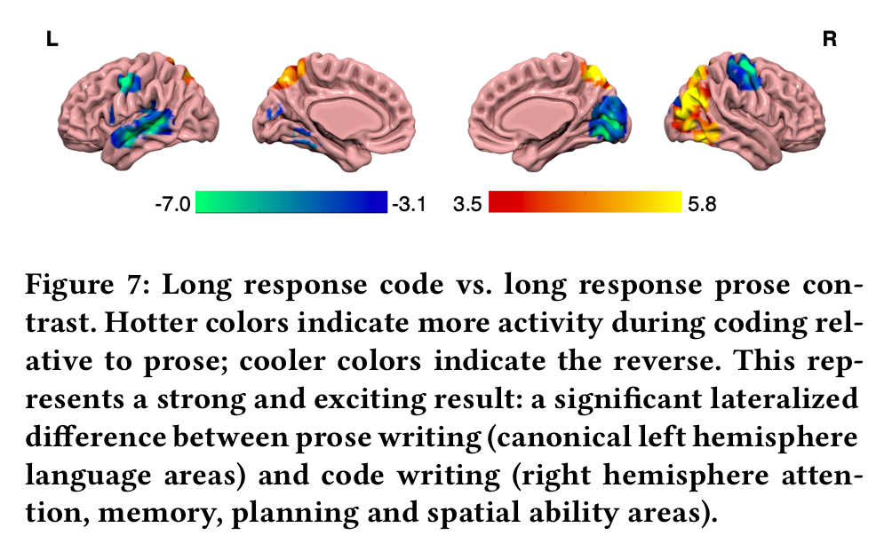

这篇paper还挺有意思 [Neurological Divide: An fMRI Study of Prose and Code Writing](https://dijkstra.eecs.umich.edu/fmri/icse20-data/icse2020-fmri-preprint.pdf)，首次利用功能性磁共振成像 (fMRI) 技术对代码写作过程进行了研究，并发现代码写作和散文写作在大脑神经活动上存在显著差异，如文中所说：

> While prose writing entails significant left hemisphere activity associated with language, code writing involves more activations of the right hemisphere, including regions associated with attention control, working memory, planning and spatial cognition.

看图更直观：

三个主要结果：

* 代码写作和散文写作在大脑神经活动上存在着显著且广泛的差异：大脑并不将这两者视为相似的任务。
* 在较低层次上（例如，生成一个单词或一个代码元素），写代码需要大脑中与精细的自上而下的控制、规划和分类相关的区域进行更显著的活动。尽管表面上相似，但与散文相比，代码似乎是一种在类别上完全不同的视觉刺激。
* 高层次的长篇代码编写与散文写作有着显著的不同，散文写作涉及传统上与语言相关的左脑区域，而我们发现了一种明显的半脑侧化区别：与散文写作相比，代码写作并不会显著调用这些区域，反而是激活了与注意力、记忆、规划和空间能力相关的右脑区域。

有趣的是超过1/3的参与者在事后调查中报告说，他们认为代码写作和散文写作有相似之处 ，但fMRI的客观测量结果狠狠打脸。

啊我的脑子，了解更多自己的脑子总是挺好的。鉴于我整个白天都在写代码了，为了我脑子的全面发展，我要多写作！

很明显的一个后续方向是，AI时代的程序员会如何，有了copliot帮助下的程序员在写代码的时候肯定激活区域还是有区别的。

之前简单读过这篇还是挺有趣的，[Your Brain on ChatGPT: Accumulation of Cognitive Debt when Using an AI Assistant for Essay Writing Task](https://arxiv.org/abs/2506.08872)。如果说上一篇paper研究的是大脑在自力更生时是如何高效运作的，这一篇就是研究了当这种认知被外包给AI时会发生什么。实验将被试分成三组，根据相同的题目撰写论文，但每个小组的写作辅助工具不同，LLM组可以使用ChatGPT，搜索组可以使用搜索引擎，纯脑力组不使用任何工具，使用脑电图 (EEG) 评估论文写作过程中的认知负荷。发现与完全依靠自己或使用搜索引擎的学生相比，使用LLM的学生的大脑网络连接性最弱，认知参与度最低，LLM用户很难准确引用或复述自己（在AI辅助下）写过的内容，LLM用户对自己所写论文的“所有权感”最低。所以说尽管LLM提供了极大的便利，这项研究的结果揭示了其潜在的认知成本，长期依赖AI进行写作可能会削弱我的深度学习能力、批判性思维和执行控制能力，这可不是我期望的。

当然我没有批判LLM这一系列工具的意思，工具毕竟看怎么使用。而且每当有方便的新工具出来总会被批判一番的，比如当年的谷歌[Is Google Making Us Stupid](https://www.theatlantic.com/magazine/archive/2008/07/is-google-making-us-stupid/306868/)。我只是好奇使用甚至滥用它会怎么影响我，至少我目前有个有趣的观察是，AI让我变得更没有耐心了，vibe coding有“毒”，尤其是我当给它一个我认为很简单能做好的task，它却一直失败的时候，我会很暴躁。

之前看到有老师在朋友圈发了相关的讨论，AI对人的comprehension、reasoning、agency的影响，“比方说，人自以为对创作成果的完全自主，却不知已被AI价值潜移默化影响；人自以为对AI建议的有效筛选，却不知当欺骗性AI提供“合理解释”时，就会落入盲目相信的陷阱”。所以我决定后面有空用AI帮我deep research一下这一方面，利用AI研究AI对人认知方面的的影响。

我自认为还是一个比较注重保护自己脑子的人（虽然经常晚睡，但是在改了，同时讨厌绝大多数意义上的信息推送），不管如何我总希望我的脑子被狠狠锻炼的，所以还是，多写作不同的东西，多创造新的东西！
